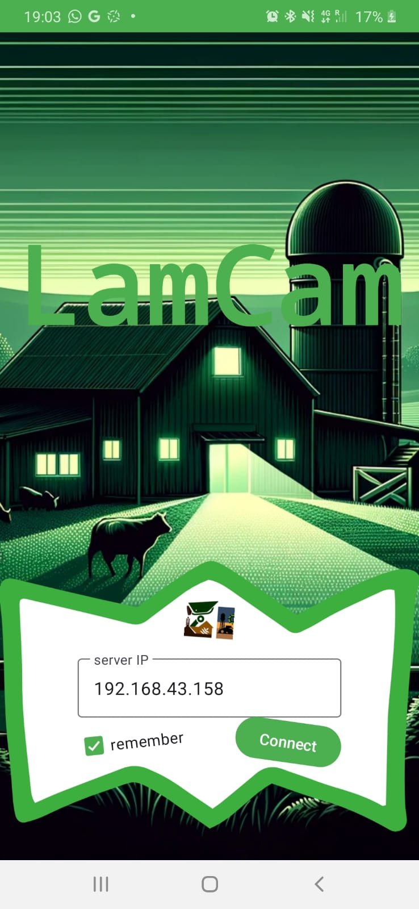
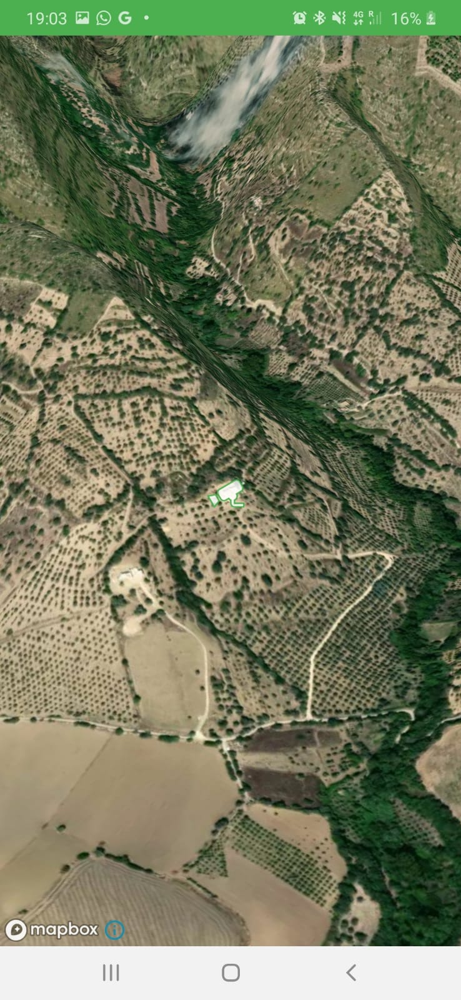
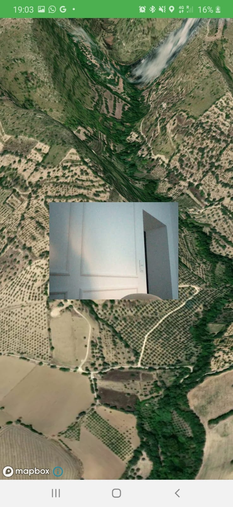
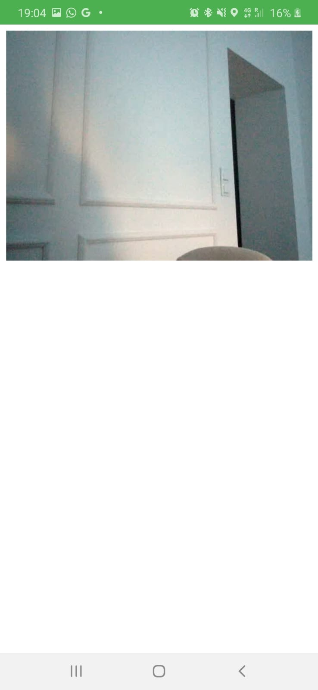
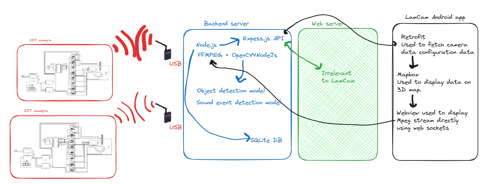
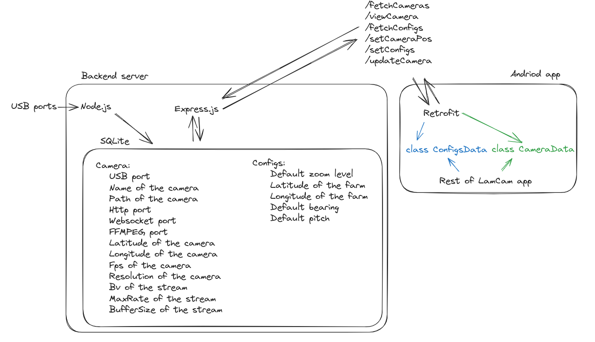

\newpage

## Introduction

LamCam is a front-end Android application for the open-source project: [Off-Grid-CCTV](https://github.com/Liam-Weitzel/Off-Grid-CCTV). [Off-Grid-CCTV](https://github.com/Liam-Weitzel/Off-Grid-CCTV) is a CCTV security system designed specifically for farms in remote areas that works wirelessly and completely off the grid. The security cameras send an analog video stream over radio to a central server. This server analyzes, catalogs, and records the video streams. LamCam aims to provide a user-friendly front-end to view the live video streams from each connected camera.

Upon opening the app, the user is prompted to enter the IP address of the server that receives each analog video stream. This server also hosts the database and API for LamCam. If the user wishes to make this server public to the internet, LamCam is able to display the video streams anywhere in the world. Of course, if the user only exposes the server to its local area network, the app will only be able to display video streams whilst on this local area network.

{width=150 margin=auto}

Upon connecting to the server, various information is fetched from the server using its API. Which is used to display a 3D representation of the farm and the location of each camera on it. The user is able to navigate and rotate the map using touch control gestures.

{width=150 margin=auto}

When a camera is selected, a small preview of the live stream is shown.

{width=150 margin=auto}

Clicking the preview will open the live stream in a simple full-screen activity.

{width=150 margin=auto}

## Motivation
The Off-Grid-CCTV project was started to solve an issue on the farm: Ongombo, Noto, Sicily. On this small olive grove, specific areas are not reachable using mobile data or Wi-Fi. Wired solutions are impractical due to the regular use of tractors and plows in the fields. Off-Grid-CCTV was started to solve this certain use case as no other existing solution on the market is able to solve this problem. The app: LamCam was created as a front-end due to the performance issues that the web-based React front-end exhibits when used on a mobile device. To address this, the lightweight native Android app LamCam with a reduced feature set was created.

## System design
To display the 3D map, the [Mapbox Maps SDK](https://docs.mapbox.com/android/maps/guides/) is used. The Mapbox Maps SDK for Android is a library for embedding highly customized maps within Android applications. Unfortunately, this dependency on Mapbox also creates a dependency on an internet connection. A solution for this problem is a work in progress: <https://github.com/Liam-Weitzel/Off-Grid-CCTV/tree/main/web/map>.  

The app LamCam requires a connection to a back-end server that receives various analog video streams. This server uses Node.js and an SQLite database to convert each received camera into a MPEG video stream. Furthermore, this server also uses object and sound event detection to determine when a security threat is in the cameras vicinity and starts recording.  

To fetch data from the aforementioned back-end server, LamCam uses the type-safe HTTP client Retrofit.  

The Express.js API on the backend server enables the Android app LamCam to create, update, and delete data from the SQLite database. For clarity purposes, the following figure depicts the API design and data flow within the system.

## Setup
Clone the Off-Grid-CCTV project using:  
`git clone https://github.com/Liam-Weitzel/Off-Grid-CCTV.git`.  

Build the docker image using: `./build-run.sh minor`.  

Before starting the server, all cameras you wish to use should be set up and connected to the server using USB analog to digital receivers. For the purposes of demonstration, any built-in webcam or USB webcam will also work. Once ready, start the web server and backend server using: `sudo docker-compose up`.  

For the time being, to build and install LamCam you will have to use Android studio... Hopefully in the future, it will be available on the Google play store.

## User guide
Using the application is simple, any camera that is connected to the server will display on the LamCam app and is interactable as previously described. To edit the settings of a specific camera please use the web-based React front-end available at: `http://localhost:3000`.
