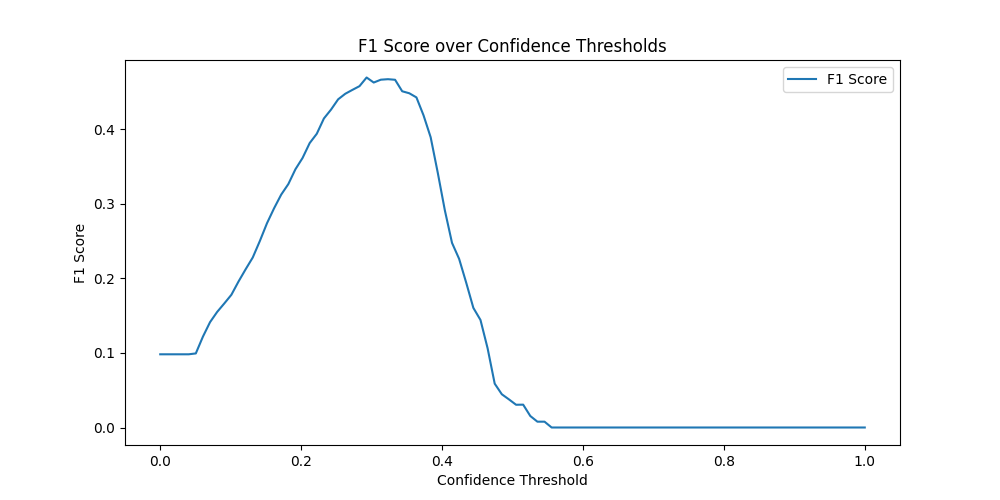
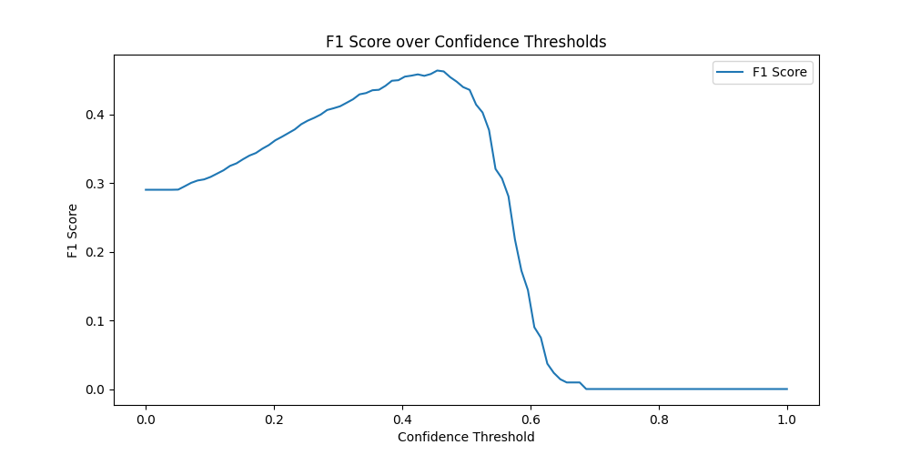
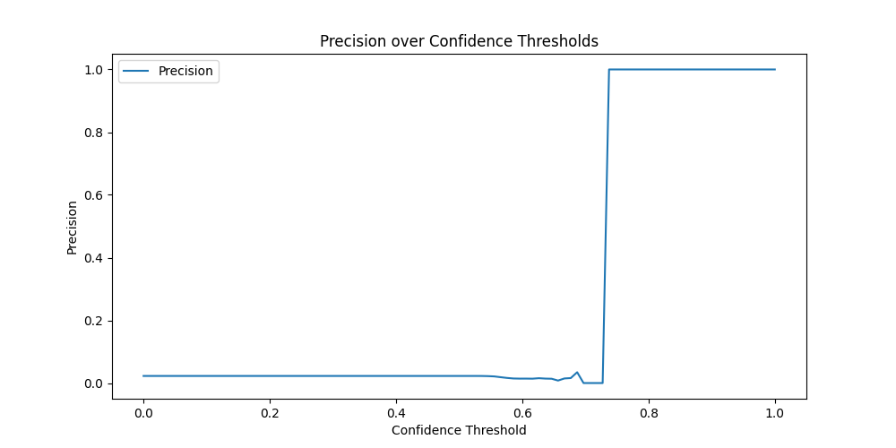
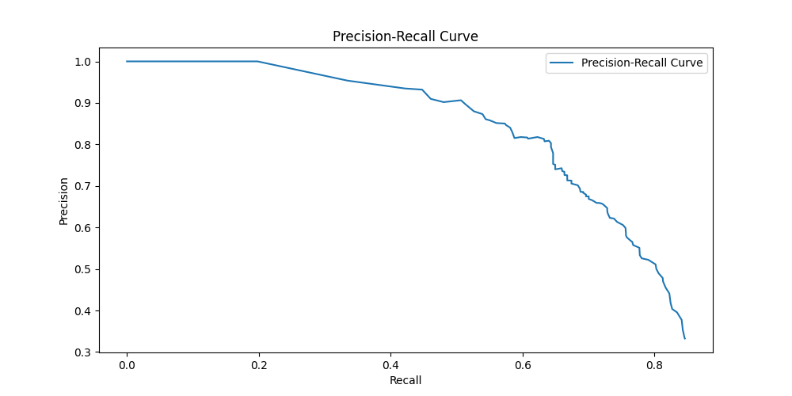
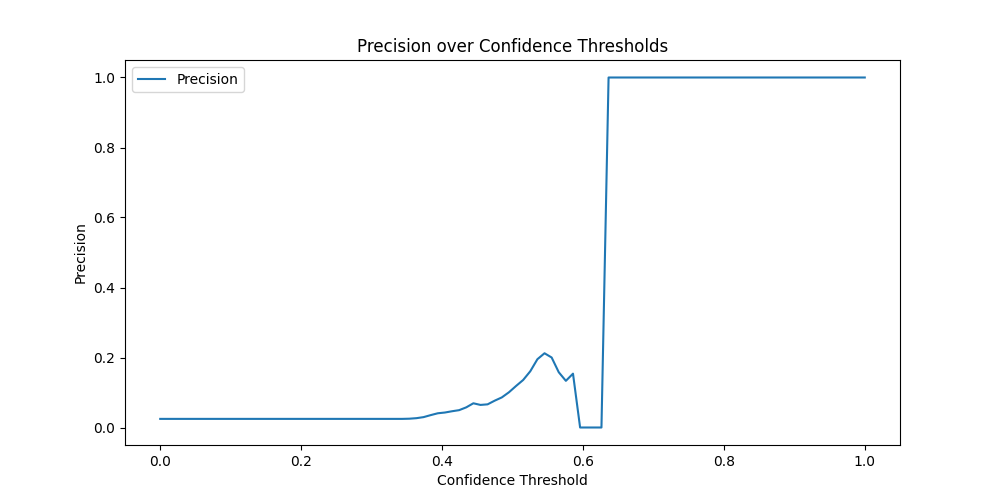
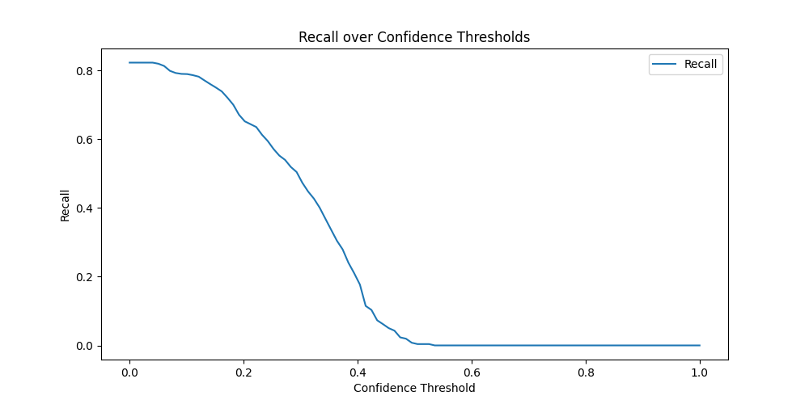
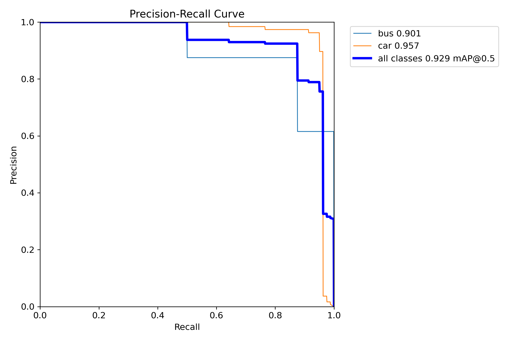
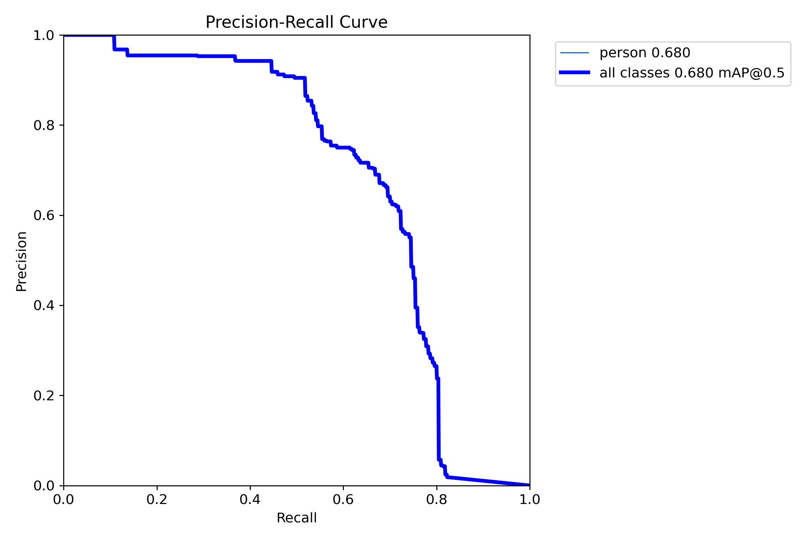
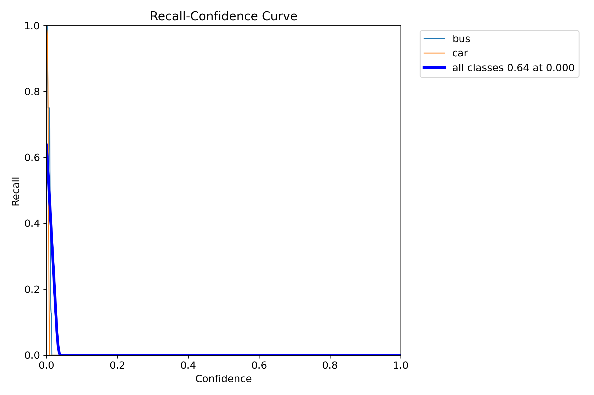

\newpage

## Abstract

This paper presents a benchmark of various object detection model architectures on five new small datasets consisting of images from analog video streams with conditions of interference. We provide the observation that live object detection on analog video streams with conditions of interference is possible with commendable performance and accuracy. The model architectures tested are Yolov8, Faster-RCNN, Masked-RCNN, and Retinanet. From these Yolov8 performed the best in terms of inference speed, although Faster-RCNN showed the highest accuracy. The hyperparameters, amount of training, and whether the model was pre-trained where adjusted and tested against.

## Introduction

Modern wireless closed-circuit television systems (CCTV) generally use IP cameras and wifi due to wifi’s high throughput and IP camera's high resolution. Although these technologies are capable of transmitting high-quality video streams, the wifi standards reliance on the 2.4 GHz and 5.8 GHz bands limits the range of these wireless systems significantly. These high-frequency bands can carry 450 Mbps and over 1 Gbps respectively but make a trade-off with range for this high throughput. For a long-range wireless CCTV application where a single video stream might only require a throughput of ~3 Mbps, this is excessive. The use of analog cameras in combination with lower radio frequencies can increase the range and penetration of the wireless link significantly. The lowest legally available frequency for hobbyist use that meets our new throughput requirement of 6 Mhz is the 900 Mhz band. Unfortunately, the 900 Mhz band is widely used by communication protocols, Internet of Things (IoT) devices, and mobile broadband which makes it susceptible to heavy interference in long-range wireless applications.

It is common practice to analyze the video streams of modern CCTV systems in real-time using object detection artificial intelligence models for security purposes. The present paper will explore how the performance of various object detection AI models can be optimized when trained on small amounts of data and applied to analog video streams in conditions of interference. Literature specifically covering object detection on analog video systems is non-existent. Regardless, the type of noise that analog video introduces is not unique, and literature regarding object detection on degraded and noisy video streams is plentiful. This is the gap in the current literature that the present paper aims to bridge.

The research topic will be explored by training various object detection models on five different analog CCTV cameras. The data for each camera was gathered over the course of 24 hours with an interval of four and a half minutes. The hyperparameters, amount of training, and whether the model was pre-trained will be adjusted and compared using industry-standard evaluation metrics.

\newpage

## Literature Review
### Latest developments in object detection

From a high-level overview of the recent literature, it is clear that the state-of-the-art object detection models use either a one-stage or two-stage method. One-stage methods are designed to decrease inference speed as much as possible whereas two-stage methods are designed to increase detection accuracy. Examples of one-stage models include RetinaNet and YOLO. Examples of two-stage models include faster R-CNN and mask R-CNN. COCO is a family of benchmark datasets that are commonly used to evaluate the performance of various models. The Mean Average Precision metric is generally used to compare and contrast models. Contrary to the latest developments in large language models, the use of transformers is limited among top-performing object detection models. As Tu et al. (2022) explain, "the lack of scalability of self-attention mechanisms with respect to image size has limited their (transformers) wide adoption in state-of-the-art vision backbones". Nonetheless, "the remarkable success of transformers in largescale language models, vision transformers (ViTs), have also swept the computer vision field and are becoming the primary choice for the research and practice of large-scale vision foundation models." (Wang et al. 2022).

Zong et al. (2022) conducted "extensive experiments to evaluate the effectiveness of the proposed approach on DETR variants". The results show a detailed benchmark table of the models: Co-DETR (Swin-L), Co-DETR and Co-DETR (single-scale) evaluated using the COCO minival, COCO test-dev, and LVIS v1.0 minival datasets. Using the box Mean Average Precision (mAP) metric it is clear that the co-DETR has the highest accuracy in this comparison. Using this mAP metric we can determine the global ranking of this model and see that it outperforms any existing current model. 

Fang et al. (2022) introduce a new model 'EVA' which outperforms many modern models and "can efficiently scale up EVA to one billion parameters". Although EVA's architecture has a heavy focus on scalability and inference speed over accuracy, the results boast a box mAP value of 64.7 which places it among the top 10 on the global rankings when trained on the COCO test-dev dataset. Furthermore, when evaluated using the COCO-O dataset EVA boasts an Average mAP of 57.8 outperforming all models to date on this dataset.

Ghiasi et al. (2020) use "a systematic study of the Copy-Paste augmentation" where the training pipeline "randomly pastes objects onto an image". "Furthermore, we show Copy-Paste is additive with semi-supervised methods that leverage extra data through pseudo labeling (e.g. self-training). On COCO instance segmentation, we achieve 49.1 mask AP and 57.3 box AP, an improvement of +0.6 mask AP and +1.5 box AP over the previous state-of-the-art. We further demonstrate that Copy-Paste can lead to significant improvements on the LVIS benchmark. Our baseline model outperforms the LVIS 2020 Challenge winning entry by +3.6 mask AP on rare categories.". But most notably for our use case, object detection, when evaluated using the PASCAL VOC 2007 dataset, they achieved a MAP of 89.3% outperforming all models on this dataset.

Li et al. (2023) with their release of YOLOv6, which is a model architecture that prioritizes inference speed over accuracy, "achieve better accuracy performance (50.0%/52.8% respectively) than other detectors at a similar inference speed". According to their published benchmarks, YOLOv6-L6 outperforms all models on the COCO 2017 val dataset. Furthermore, their YOLOX-L model outperforms all models when evaluated using the Waymo 2D detection all_ns f0val and Manga109-s 15test datasets.

MaxViT is the first model to implement the use of Transformers in its architecture. Tu et al's paper introduces MaxVit, along with its novel architecture. Tu et al's results "demonstrate the effectiveness of [MaxVit] on a broad spectrum of vision tasks". Notably for object detection, MaxVit-B outperforms all existing object detection models when evaluated using the COCO 2017 data set.

Wang et al. (2022) present "a new large-scale CNN-based foundation model, termed InternImage". "Different from the recent CNNs that focus on large dense kernels, InternImage takes deformable convolution as the core operator, so that our model not only has the large effective receptive field required for downstream tasks such as detection and segmentation, but also has the adaptive spatial aggregation conditioned by input and task information". InternImage takes the approach many modern transformer models take by architecture-level design, scaling-up parameters, and training on massive amounts of data in hopes of increasing accuracy whilst still having the benefits of a CNN architecture. This novel approach demonstrates high levels of accuracy in datasets such as COCO minival, COCO test-dev, and ADE20K. InternImage scored particularly high when evaluated using the CrowdHuman (full body) dataset outperforming all other models.

Dagli, R. and Shaikh, A. (2021) present an interesting dataset made up of medical personal protective equipment. This dataset posed challenging for models such as FasterRCNN, YOLOv3, VarifocalNet, RegNet, Deformable Convolutional Network, and Double Heads. Although the selection of models tested is not up to date, the custom model Dagli, R. and Shaikh, A. designed and trained specifically for this data set, termed TridentNet, outperformed all other models tested.

\newpage

\centerline{Table 1. Datasets listed with their best performing model}  

\begin{tabular}[t]{ll}
    **Dataset** & **Best model** \\
    COCO test-dev & Co-DETR \\
    COCO minival & Co-DETR \\
    COCO-O & EVA \\
    PASCAL VOC 2007 & Cascade Eff-B7 NAS-FPN (Copy Paste pre-training, single-scale) \\
    COCO 2017 val & YOLOv6-L6(46 fps, V100, bs1) \\
    COCO 2017 & MaxViT-B \\
    CrowdHuman (full body) & InternImage-H \\
    CPPE-5 & TridentNet \\
    Waymo detection allns f0val & YOLOX-L \\
    Manga109-s 15test & YOLOX-L \\
\end{tabular}  

\begin{center}
This table summarizes the paragraphs above, listing each dataset alongside the model architecture that had the highest normalized score across all reported metrics.
\end{center}

Lastly, Shinya, Y. (2021) further justified the results from the aforementioned studies in the study "USB: Universal-Scale Object Detection Benchmark". This study aims to fairly compare and benchmark various object detection models by mixing popular datasets such as COCO, with newer datasets such as Waymo Open Dataset and Manga109-s. This amalgamated dataset hopes to address some of the issues observed when benchmarking with COCO like datasets.

### Types of noise and their impact

There are too many sources of noise present in a CCTV camera transmitting analog video over 900 MHz to list. The nature of the noise is hard to predict due to the medium over which the video signal travels. There are many more variations in air than a standard cable. Perhaps one camera has some foilage in the signal path, other camera systems might have a direct line of sight. Regardless, there are also some constant sources of noise present in this system. The two primary sources of predictable, and constant noise are the analog-to-digital conversion circuit and the de-interlacing process of the analog video. These two components introduce a distinct type of interference which we can discuss and improve. Analog to digital video conversion is known to introduce 'salt-and-pepper' noise. "This kind of noise randomly changes intensities of some pixels to the maximum or minimum values of the intensity range on the image/video" (Veerakumar et al. 2011). Furthermore, analog video has certain characteristics which can also be interpreted as 'noise'. One of which is caused by the de-interlacing process upon which both NTSC and PAL analog video protocols are built, causing analog video to have distinct visible lines going across the image. Lastly, both NTSC and PAL have a limit of transmitting 0.3 Megapixel images which can be interpreted as a 'low resolution' image and hence also 'noise'.

An exhaustive search reveals that only a limited amount of literature exists on the effects of more generally, 'noise', on the performance of object detection models. It is important to note that this search did not reveal any sources specifically covering noise induced from analog video transmitted over any radio frequency. 

Interestingly, Momeny et al. (2021) discuss the use of noise as a data augmentation method to improve accuracy for image classification CNN models. An increase in training speed and accuracy was observed although the increase in accuracy was primarily observed in noisy images.

Nazaré et al. (2018), aim to "evaluate the generalization of models learned by different networks using noisy images". The results indicate that if the application's image quality is prone to noise, training the image classification model on noisy images will generally increase its accuracy. This directly contradicts Paranhos Da Costa et al. (2016) in the study "An empirical study on the effects of different types of noise in image classification tasks", who speculate "noise makes classification more difficult due to the fact that models trained with a particular noisy/restored training set version – and tested on images with the same noise configuration – usually perform worse than a model trained and tested on the original data".

Rodríguez et al. (2024) discuss the impact of many different types of noise on object detection models. This paper has a particular focus on Gaussian noise and brightness noise which are both types of noise that are also present in our video. The effects of these two types of noise are tested on various YOLO object detection models, as well as FasterRCNN ResNet50. The results show that "the size of objects to be detected is a factor that, together with noise and brightness factors, has a considerable impact on their performance".

Veerakumar et al. (2011) propose an algorithm that effectively removes 'salt-and-pepper' noise from any given image. The proposed solution uses a 3x3 pixel search grid and determines the median pixel RGB value. This process effectively blurs the image, removing noise but also significantly lowering the resolution. Nonetheless, it is untested how applying this algorithm would impact the performance of object detection models.

### Impact of low-resolution video on object detection

As previously discussed, the impact of radio channel interference-induced noise on the performance of object detection models on videos streamed over 900 MHz is not well researched, thus the impact of low resolution is covered in this section in hopes that the strategies covered to increase performance can be used interchangeably between these two contexts. Uzkent et al. (2019) explore an approach to increase the performance of a reinforcement learning object detection agent in high-resolution images. The agent chooses parts of the image to analyze, effectively lowering the resolution and maintaining accuracy while increasing performance. This approach resulted in a 50% increase in runtime without compromising accuracy. Instead, Lu et al. (2015) utilize a deep convolutional neural network to improve object detection on high-resolution images.

Contrarily, Kidwell et al. (2015) directly address the challenge of maintaining detection performance with low-resolution images. Kidwell et al. (2015) investigate object detection in low-resolution overhead imagery presenting a novel detection system that employs a fast sliding-window detector using a histogram of oriented gradient (HOG) and a supervised support vector machine classifier. This approach shows promising accuracy but sacrifices performance. Furthermore, Kidwell et al. (2015) state that this approach shows an increase in accuracy even with less annotated training data compared to their benchmark object detection algorithm. Pava et al. (2011) discuss object detection on low-resolution 3-D model animations. Pava et al. (2011) propose an elaborate system compromising of preprocessing, background modeling, information extraction, and postprocessing stages. Similarly, Kidwell et al. (2015) utilized techniques such as Histogram of Oriented Gradient (HOG) and equalization, background subtraction, and various filtering techniques. Zhang et al. (2007) introduce a novel multi-resolution framework for object detection which is inspired by human visual search patterns. Zhang et al. (2007)’s proposed algorithm artificially lowers the resolution of the image and attempts to detect the object in the image. If the confidence score of the result is low, increase the resolution and try again. This approach allows for an 'early exit' designed for real-time analysis significantly increasing performance while maintaining high detection accuracy. Most notably, Clark et al. (2023) investigate the resolution-performance trade-off of object detection models. Clark et al. (2023) found a linear relationship between resolution and detection accuracy highlighting the crucial role of resolution in object detection. The present paper will use the prior techniques discussed to attempt to increase the performance and accuracy of object detection on video streams that are missing information due to interference on the 900 MHz band.

\newpage

## Methods
### Procuring the data

To evaluate the performance of various object detection models on analog video under the condition of significant interference, five live analog camera video streams were selected with varying levels of noise. The five cameras are located at:

Place: Hadji Dimitar Square, Sliven, Bulgaria  
Coordinates: 41.940300 / 25.569401

Place: Keskväljak, Paide, Estonia  
Coordinates: 59.433899 / 24.728100

Place: Duomo, Noto, Sicily, Italy  
Coordinates: 36.890140 / 15.069290

Place: Kielce University of Technology, Kielce, Poland  
Coordinates: 50.833302 / 20.666700

Place: Toggenburg Alpaca Ranch, Stein, Switzerland  
Coordinates: 47.366699 / 8.550000

Using ffmpeg and bash a frame was captured from each camera at a 4-and-a-half minute interval: `while true; do ffmpeg -i INPUT -frames:v 1 -vcodec mjpeg -f image2 \~/Downloads/frames/image$(date +%Y%m%d%H%M%S).jpg; sleep 270; done`.

Data collection lasted for 24 hours, on all cameras simultaneously, on the 2nd of January 224, resulting in 323 images (frames) captured per camera.

Each frame was labeled by hand, over the course of the next week, using a webapp called roboflow. The resulting dataset for each camera has a 70%/20%/10% split between training, test, and validation data respectively.

No augmentation methods of any kind are applied to the final datasets.

### Models

The model architectures that will be compared in the present paper are Faster-RCNN, Masked-RCNN, Retinanet, Yolov8.

### Hyper parameters

Before training, hyper parameter tuning was conducted for each dataset using Yolov8 using the AdamW optimization algorithm, for 300 iterations of 50 epochs each.

\newpage

### Training and evaluation

To evaluate the aforementionend model architectures the industry standard metrics: precision, recall, F1-Score, and confidence will be used. To be specific, for each trained model, the graphs: precision over confidence, recall over confidence, F1 over confidence, and precision over recall will be used to evaluate each model. For all models trained using the yolov8 architecture, a normalized and non-normalized confusion matrix will also be used. Each model architecture will be trained on each dataset for 150 epochs. Whether the model has peen pre-trained, and/ or hyperparameter tuned will be varied. Each model will be evaluated every 50 epochs.

Independent variables:  
Model Type: Yolov8, Faster-RCNN, Masked-RCNN, Retinanet-RCNN.  
Training Epochs: The number of epochs each model will be trained for.  
Pre-training: Whether the models are pre-trained or not.  
Parameter Tuning: Whether the models will use stock parameters or will be hyperparameter-tuned.  

Dependent variables:  
Performance Metrics: Precision, recall, F1-score, confidence, confusion matrices.  
Resource Utilization: All models will be trained on the same hardware with the same resource utilization.  

\newpage

## Results
### Explain the metrics

Precision is the ratio of true positives to the sum of true and false positives.
$$ Precision = (True Positives+False Positives) / True Positives $$

Recall is the ratio of true positives to the sum of true positives and false negative.
$$ Recall = (True Positives+False Negatives) / True Positives $$

Using precision we can effectively deduce how many objects were correctly labeled out of all labeled objects.
Similarly, using recall we can deduce how many objects were correctly labeled out of all objects whether they were labeled or not.

The F1 score is simply a harmonic mean of precision and recall, allowing us to combine precision and recall into a 'score'.
$$ F1 = 2 * ((Precision + Recall) / (Precision * Recall)) $$

Before analyzing the results, it is important to note that not all results are shown in the present paper's 'results' section. For a complete breakdown of the results see the supplementary data section. Regardless, a selection of representative results has been assembled and will be reviewed in the interest of brevity instead.

### Best performing final model comparison

A comparison of the best models trained on the Doumo dataset.  

{width=50%}
{width=50%}  
Figure 552. \hfill Figure 120.  

{width=50%}
{width=50%}  
Figure 260. \hfill Figure 340.  

Figure 552 depicts the F1 over confidence graph for the pre-trained and hyperparameter-tuned yolov8n model trained on the Duomo dataset for 150 epochs. 
Figure 120 depicts the F1 over confidence graph for the pre-trained Faster-RCNN model trained on the Duomo dataset for 150 epochs. 
Figure 260 depicts the F1 over confidence graph for the pre-trained Masked-RCNN model trained on the Duomo dataset for 150 epochs. 
Figure 340 depicts the F1 over confidence graph for the pre-trained Retinanet model trained on the Duomo dataset for 150 epochs. 

A comparison of the best models trained on the Hadji Dimitar Square dataset.

{width=50%}
{width=50%}  
Figure 570. \hfill Figure 124.

{width=50%}
{width=50%}  
Figure 264. \hfill Figure 344.  

Figure 570 depicts the F1 over confidence graph for the pre-trained and hyperparameter-tuned yolov8n model trained on the Hadji Dimitar Square dataset for 150 epochs. 
Figure 124 depicts the F1 over confidence graph for the pre-trained Faster-RCNN model trained on the Hadji Dimitar Square dataset for 150 epochs. 
Figure 264 depicts the F1 over confidence graph for the pre-trained Masked-RCNN model trained on the Hadji Dimitar Square dataset for 150 epochs. 
Figure 344 depicts the F1 over confidence graph for the pre-trained Retinanet model trained on the Hadji Dimitar Square dataset for 150 epochs. 

### Effect of hyper-parameter tuning 

A comparison of hyperparameter tuned model against a non-hyperparameter tuned model trained on the Hadji Dimitar Square dataset.

{width=50%}
{width=50%}  
Figure 570. \hfill Figure 390.  

Figure 570 depicts the F1 over confidence graph for the pre-trained and hyperparameter-tuned yolov8n model trained on the Hadji Dimitar Square dataset for 150 epochs. Instead, Figure 390 depicts the F1 over confidence graph for the pre-trained but not hyperparameter-tuned yolov8n model trained on the Hadji Dimitar Square dataset for 150 epochs.

A comparison of hyperparameter tuned model against a non-hyperparameter tuned model trained on the Keskväljak dataset.

{width=50%}
{width=50%}  
Figure 588. \hfill Figure 408.  

Figure 588 depicts the F1 over confidence graph for the pre-trained and hyperparameter-tuned yolov8n model trained on the Keskväljak dataset for 150 epochs. Instead, Figure 408 depicts the F1 over confidence graph for the pre-trained but not hyperparameter-tuned yolov8n model trained on the Keskväljak dataset for 150 epochs.

### Effect of pre-training

Comparing the peformance of a Yolov8n pre-trained model against a Yolov8n non-pre-trained model that were both trained on the Doumo dataset for 150 epochs.

{width=50%}
{width=50%}  
Figure 462. \hfill Figure 372.  

Figure 372 depicts the F1 over confidence graph for the pre-trained yolov8n model trained on the Doumo dataset for 150 epochs. Instead, Figure 462 depicts the F1 over confidence graph for the non-pre-trained yolov8n model trained on the Doumo dataset for 150 epochs.

Comparing the peformance of a Faster-RCNN pre-trained model against a Faster-RCNN non-pre-trained model that were both trained on the Keskväljak dataset for 150 epochs.

{width=50%}
{width=50%}  
Figure 48. \hfill Figure 128.  

Figure 128 depicts the f1 over confidence graph for the pre-trained Faster-RCNN model trained on the Keskväljak dataset for 150 epochs. Instead, figure 48 depicts the f1 over confidence graph for the non-pre-trained Faster-RCNN model trained on the Keskväljak dataset for 150 epochs.

Comparing the peformance of a Yolov8n pre-trained model against a Yolov8n non-pre-trained model that were both trained on the Keskväljak dataset for 150 epochs.

{width=50%}
{width=50%}  
Figure 498. \hfill Figure 408.  

Figure 408 depicts the f1 over confidence graph for the pre-trained yolov8n model trained on the Keskväljak dataset for 150 epochs. Instead, figure 498 depicts the f1 over confidence graph for the non-pre-trained yolov8n model trained on the Keskväljak dataset for 150 epochs.

Comparing the peformance of a Masked-RCNN pre-trained model against a Masked-RCNN non-pre-trained model that were both trained on the Keskväljak dataset for 150 epochs.

{width=50%}
{width=50%}  
Figure 188. \hfill Figure 268.  

Figure 268 depicts the f1 over confidence graph for the pre-trained Masked-RCNN model trained on the Keskväljak dataset for 150 epochs. Instead, figure 188 depicts the f1 over confidence graph for the non-pre-trained Masked-RCNN model trained on the Keskväljak dataset for 150 epochs.

### Effect of training on specialized data

A comparison of the effectiveness of training on data similar to the evaluation data. The following graphs demonstrate how the evaluation is effected during training. The first sample is an evaluation taken at 0 epochs, the last, at 150 epochs, with an evaluation at an interval of 50 epochs.

{width=25%}
{width=25%}
{width=25%}
{width=25%}  
Figure 720. \hfill Figure 360. \hfill Figure 366. \hfill Figure 372.  

Figure 720 depicts the F1 over confidence graph for the pre-trained Yolov8n model trained on the Duomo dataset for 0 epochs. The second figure, 360. depicts the F1 over confidence graph for the pre-trained Yolov8n model trained on the Duomo dataset for 50 epochs. The third figure, 366. depicts the F1 over confidence graph for the pre-trained Yolov8n model trained on the Duomo dataset for 100 epochs. Lastly, the fourth figure, 372. depicts the F1 over confidence graph for the pre-trained Yolov8n model trained on the Duomo dataset for 150 epochs.

## Discussion

Suprisingly, when trained for 150 epochs, the model architectures: Masked-RCNN, and Faster-RCNN consistently outperformed Yolov8n eventhough Yolov8n was the only model that was hyperparameter tuned for 300 iterations using the AdamW optimization algorithm. Furthermore, both the Masked-RCNN and Faster-RCNN use a Resnet50 backend. This backend is considerably outdated compared to Yolov8 which was released in 2023. Nonetheless, it's important to mention that Yolov8n has a considerably faster inference time than Masked-RCNN and Faster-RCNN and is able to keep up with a 3 fps live stream when Masked-RCNN and Faster-RCNN are only able to infer one frame every two seconds.

The effect of hyper parameter tuning on Yolov8 across all datasets did not give any conclusive results. Depending on the dataset, the accuracy increased or decreased. There was no generalizable result observed.

Similarly, the effect of pre-training, which is also commonly known as transfer learning, also gave inconclusive results. Some data sets benefited greatly from pre-training where as other data sets were affected negatively. Pre-training did seem to generally increase the peformance of each model particularly when only trained for a short amount of time. Regardless, without a statistical analysis its not possible to derive a conclusion.

The observed effect of training on specialized data is doubtlessly positive. There has not been a single case where training the model on any of the datasets decreased the performance when evaluated using a similar evaluation dataset. This aligns directly with the findings of Dagli, R. and Shaikh, A. (2021). 

These results are promising for wireless analog CCTV system applications as it has been shown that high accuracy real time object detection is possible with a small dataset of 323 specialized images even under the condition of interference. From the results of the present paper it can be deduced that the type of noise that analog video introduces does not pose challenge for modern object detection model architectures, bridging this gap in the current literature.

The methods used in the present paper has many limitations. Unfortunately, the training and evaluation pipeline written in python for all models created with the Retinanet model architecture failed and produced incomprihensible results. This is a major oversight and could have been easily avoided with more rigorous testing. This is also the reason for Retinanet's exclusion in many of the comparisons in the results. A full breakdown of the results produced by any model trained using the Retinanet architecture can be found in the supplementary data.

Furthermore, another major limitation of the present paper is that not enough model architectures were compared to come to a conclusive answer. The literature review revealed the vast amount of model architectures and benchmarking datasets available. Having only rigorously tested and compared four different model architectures, the present paper would benefit significantly from a wider comparison.

Lastly, all datasets had a significant amount of analog noise. This leads to a question whether the analog noise in the datasets actually had any impact at all. To test this an analog noise generation algorithm would have to be applied to images that do not have any analog noise present. This data augmentation method could be explored as a future research.

## Conclusion

The use of modern object detection models on wireless analog CCTV systems is more than feasable. A small dataset of 323 images can be collected and labeled within a day. Without this small dataset of specialized data, the performance of any pre-trained model will be subpar. All five datasets procured in the present paper, with varying levels of analog noise, were able to train a model with sufficient performance for CCTV and security applications. Furthermore, the use of pre-training and hyperparameter tuning can have a positive impact on performance but also showed to have a negative impact depending on the dataset and chosen model architecture.

## References

Adavanne, S., Pertila, P. and Virtanen, T. (2017) “Sound event detection using spatial features and convolutional recurrent neural network,” IEEE International Conference on Acoustics, Speech, and Signal Processing, pp. 771–775. Available at: https://doi.org/10.1109/ICASSP.2017.7952260.

Agrawal, N.K. and Shankhdhar, A. (2022) “An Enhanced and Effective Approach for Object Detection using Deep Learning Techniques,” SMART, pp. 1482–1486. Available at: https://doi.org/10.1109/SMART55829.2022.10046678.

Atrey, P.K., Maddage, N.C. and Kankanhalli, M.S. (2006) “Audio Based Event Detection for Multimedia Surveillance,” 2006 IEEE International Conference on Acoustics Speech and Signal Processing Proceedings, 5. Available at: https://doi.org/10.1109/ICASSP.2006.1661400.

Boisbunon, A. et al. (2014) “Large Scale Sparse Optimization for Object Detection in High Resolution Images.”

Chavdar, M. et al. (2020) “Towards a system for automatic traffic sound event detection,” Telecommunications Forum [Preprint]. Available at: https://doi.org/10.1109/TELFOR51502.2020.9306592.

Choi, I. et al. (2016) “Dnn-based Sound Event Detection With Exemplar-based Approach for Noise Reduction.”

Clark, C.N. et al. (2023) “Investigating the Resolution-Performance Trade-off of Object Detection Models in Support of the Sustainable Development Goals,” IEEE Journal of Selected Topics in Applied Earth Observations and Remote Sensing, 16, pp. 5695–5713. Available at: https://doi.org/10.1109/JSTARS.2023.3284309.

Dagli, R. and Shaikh, A.M. (2021) “CPPE-5: Medical Personal Protective Equipment Dataset.”

Elizalde, B. et al. (2016) “An approach for self-training audio event detectors using web data,” European Signal Processing Conference, 2017-January, pp. 1863–1867. Available at: https://doi.org/10.23919/EUSIPCO.2017.8081532.

Fang, Y. et al. (2022) “EVA: Exploring the Limits of Masked Visual Representation Learning at Scale.”

Foggia, P. et al. (2015) “Reliable detection of audio events in highly noisy environments,” Pattern Recognition Letters, 65, pp. 22–28. Available at: https://doi.org/10.1016/J.PATREC.2015.06.026.

Gemmeke, J.F. et al. (2013) “An exemplar-based NMF approach to audio event detection,” IEEE Workshop on Applications of Signal Processing to Audio and Acoustics [Preprint]. Available at: https://doi.org/10.1109/WASPAA.2013.6701847.

Ghiasi, G. et al. (2020) “Simple Copy-Paste is a Strong Data Augmentation Method for Instance Segmentation.”

Hanus, S. and Gleissner, F. (2008) “Co-channel and Adjacent Channel Interference Measurement of UMTS and GSM/EDGE Systems in 900 MHz Radio Band.”

Howard, A. and Padgett, C. (2003) “An adaptive learning methodology for intelligent object detection in novel imagery data,” Neurocomputing, 51, pp. 1–11. Available at: https://doi.org/10.1016/S0925-2312(02)00598-2.

Jadhav, R. et al. (2022) “Drone Based Object Detection using AI,” 2022 International Conference on Signal and Information Processing, IConSIP 2022 [Preprint]. Available at: https://doi.org/10.1109/ICONSIP49665.2022.10007476.

Jain, A. et al. (2021) “AI-Enabled Object Detection in UAVs: Challenges, Design Choices, and Research Directions,” IEEE Network, 35(4), pp. 129–135. Available at: https://doi.org/10.1109/MNET.011.2000643.

Jensen, R. (1977) “900-MHz mobile radio propagation in the Copenhagen area,” IEEE Transactions on Vehicular Technology, VT-26(4), pp. 328–331. Available at: https://doi.org/10.1109/T-VT.1977.23702.

Kidwell, P. and Boakye, K. (2015) “Object Detection in Low Resolution Overhead Imagery,” 2015 IEEE Winter Applications and Computer Vision Workshops, pp. 21–27. Available at: https://doi.org/10.1109/WACVW.2015.16.

Küçükbay, S.E. and Sert, M. (2015) “Audio-based event detection in office live environments using optimized MFCC-SVM approach,” Proceedings of the 2015 IEEE 9th International Conference on Semantic Computing (IEEE ICSC 2015), pp. 475–480. Available at: https://doi.org/10.1109/ICOSC.2015.7050855.

Li, B. et al. (2022) “Analysis of Automotive Camera Sensor Noise Factors and Impact on Object Detection,” IEEE Sensors Journal, 22(22), pp. 22210–22219. Available at: https://doi.org/10.1109/JSEN.2022.3211406.

Li, C. et al. (2023) “YOLOv6 v3.0: A Full-Scale Reloading.”

Lu, Y. and Javidi, T. (2015) “Efficient object detection for high resolution images,” Allerton Conference on Communication, Control, and Computing, pp. 1091–1098. Available at: https://doi.org/10.1109/ALLERTON.2015.7447130.

Meinedo, H. and Neto, J. (2005) “A stream-based audio segmentation, classification and clustering pre-processing system for broadcast news using ANN models,” Interspeech, pp. 237–240. Available at: https://doi.org/10.21437/INTERSPEECH.2005-117.

Mesaros, A. et al. (2010) “Acoustic event detection in real life recordings,” European Signal Processing Conference [Preprint].

Momeny, M. et al. (2021) “A noise robust convolutional neural network for image classification.” Available at: https://doi.org/10.1016/j.rineng.2021.100225.

Nazaré, T.S. et al. (2018) “Deep convolutional neural networks and noisy images,” Lecture Notes in Computer Science (including subseries Lecture Notes in Artificial Intelligence and Lecture Notes in Bioinformatics), 10657 LNCS, pp. 416–424. Available at: https://doi.org/10.1007/978-3-319-75193-1_50/TABLES/3.

Okamoto, D. et al. (2016) “Performance evaluation of digital TV and LTE systems operating in the 700 MHz band under the effect of mutual interference,” Journal of Microwaves, Optoelectronics and Electromagnetic Applications, 15(4), pp. 441–456. Available at: https://doi.org/10.1590/2179-10742016V15I4831.

Paranhos Da Costa, G.B. et al. (2016) “An empirical study on the effects of different types of noise in image classification tasks.” Available at: https://ruiminpan.wordpress.com/2016/03/10/ (Accessed: April 25, 2024).

Park, D., Ramanan, D. and Fowlkes, C. (2010) “Multiresolution models for object detection,” Lecture Notes in Computer Science (including subseries Lecture Notes in Artificial Intelligence and Lecture Notes in Bioinformatics), 6314 LNCS(PART 4), pp. 241–254. Available at: https://doi.org/10.1007/978-3-642-15561-1_18.

Pava, D. and Rhodes, W. (2011) “Object Detection and Motion Analysis in a Low Resolution 3-D Model.”

-Rodríguez, R. et al. (2024) “The Impact of Noise and Brightness on Object Detection Methods,” Sensors 2024, Vol. 24, Page 821, 24(3), p. 821. Available at: https://doi.org/10.3390/S24030821.

Shinya, Y. (2021) “USB: Universal-Scale Object Detection Benchmark.”

de Sousa Chaves, F. and Ruismaki, R. (2014) “LTE 700 MHz: Evaluation of the Probability of Interference to Digital TV,” IEEE Vehicular Technology Conference [Preprint]. Available at: https://doi.org/10.1109/VTCFALL.2014.6966043.

Surampudi, N., Srirangan, M. and Christopher, J. (2019) “Enhanced Feature Extraction Approaches for Detection of Sound Events,” IEEE International Advance Computing Conference, pp. 223–229. Available at: https://doi.org/10.1109/IACC48062.2019.8971574.

Tu, Z. et al. (2022) “MaxViT: Multi-Axis Vision Transformer.”

Uzawa, H. et al. (2021) “High-definition object detection technology based on AI inference scheme and its implementation,” IEICE Electronics Express, 18(22). Available at: https://doi.org/10.1587/ELEX.18.20210323.

Uzkent, B., Yeh, C. and Ermon, S. (2019) “Efficient Object Detection in Large Images Using Deep Reinforcement Learning,” IEEE Workshop/Winter Conference on Applications of Computer Vision, pp. 1813–1822. Available at: https://doi.org/10.1109/WACV45572.2020.9093447.

Valenti, M. et al. (2017) “A neural network approach for sound event detection in real life audio,” European Signal Processing Conference, 2017-January, pp. 2754–2758. Available at: https://doi.org/10.23919/EUSIPCO.2017.8081712.

Veerakumar, T., Esakkirajan, S. and Vennila, I. (2011) “Salt and pepper noise removal in video using adaptive decision based median filter,” 2011 International Conference on Multimedia, Signal Processing and Communication Technologies, IMPACT 2011, pp. 87–90. Available at: https://doi.org/10.1109/MSPCT.2011.6150444.

Wang, W. et al. (2022) “InternImage: Exploring Large-Scale Vision Foundation Models with Deformable Convolutions.”

Wang, Z. et al. (2018) “A variable resolution feedback improving the performances of object detection and recognition,” Proceedings of the Institution of Mechanical Engineers, Part I: Journal of Systems and Control Engineering, 232(4), pp. 417–427. Available at: https://doi.org/10.1177/0959651817721404.

Xia, X. et al. (2020) “Sound Event Detection Using Multiple Optimized Kernels,” IEEE/ACM Transactions on Audio Speech and Language Processing, 28, pp. 1745–1754. Available at: https://doi.org/10.1109/TASLP.2020.2998298.

Zhang, W., Zelinsky, G. and Samaras, D. (2007) “Real-time Accurate Object Detection using Multiple Resolutions,” IEEE International Conference on Computer Vision [Preprint]. Available at: https://doi.org/10.1109/ICCV.2007.4409057.

Zhuang, X. et al. (2010) “Real-world acoustic event detection,” Pattern Recognition Letters, 31(12), pp. 1543–1551. Available at: https://doi.org/10.1016/J.PATREC.2010.02.005.

Zong, Z., Song, G. and Liu, Y. (2022) “DETRs with Collaborative Hybrid Assignments Training.”

## Supplementary data

Figure 1. f1_over_confidence, fasterrcnn, pre-trained=False, epochs=50, data=duomo  
  
Figure 2. precision_over_confidence, fasterrcnn, pre-trained=False, epochs=50, data=duomo  
  
Figure 3. precision_over_recall, fasterrcnn, pre-trained=False, epochs=50, data=duomo  
  
Figure 4. recall_over_confidence, fasterrcnn, pre-trained=False, epochs=50, data=duomo  
  
Figure 5. f1_over_confidence, fasterrcnn, pre-trained=False, epochs=50, data=hadji_dimitar_square  
  
Figure 6. precision_over_confidence, fasterrcnn, pre-trained=False, epochs=50, data=hadji_dimitar_square  
  
Figure 7. precision_over_recall, fasterrcnn, pre-trained=False, epochs=50, data=hadji_dimitar_square  
  
Figure 8. recall_over_confidence, fasterrcnn, pre-trained=False, epochs=50, data=hadji_dimitar_square  
  
Figure 9. f1_over_confidence, fasterrcnn, pre-trained=False, epochs=50, data=keskvaljak  
  
Figure 10. precision_over_confidence, fasterrcnn, pre-trained=False, epochs=50, data=keskvaljak  
  
Figure 11. precision_over_recall, fasterrcnn, pre-trained=False, epochs=50, data=keskvaljak  
  
Figure 12. recall_over_confidence, fasterrcnn, pre-trained=False, epochs=50, data=keskvaljak  
  
Figure 13. f1_over_confidence, fasterrcnn, pre-trained=False, epochs=50, data=kielce_university_of_technology  
  
Figure 14. precision_over_confidence, fasterrcnn, pre-trained=False, epochs=50, data=kielce_university_of_technology  
  
Figure 15. precision_over_recall, fasterrcnn, pre-trained=False, epochs=50, data=kielce_university_of_technology  
  
Figure 16. recall_over_confidence, fasterrcnn, pre-trained=False, epochs=50, data=kielce_university_of_technology  
  
Figure 17. f1_over_confidence, fasterrcnn, pre-trained=False, epochs=50, data=toggenburg_alpaca_ranch  
  
Figure 18. precision_over_confidence, fasterrcnn, pre-trained=False, epochs=50, data=toggenburg_alpaca_ranch  
  
Figure 19. precision_over_recall, fasterrcnn, pre-trained=False, epochs=50, data=toggenburg_alpaca_ranch  
  
Figure 20. recall_over_confidence, fasterrcnn, pre-trained=False, epochs=50, data=toggenburg_alpaca_ranch  
  
Figure 21. f1_over_confidence, fasterrcnn, pre-trained=False, epochs=100, data=duomo  
  
Figure 22. precision_over_confidence, fasterrcnn, pre-trained=False, epochs=100, data=duomo  
  
Figure 23. recall_over_confidence, fasterrcnn, pre-trained=False, epochs=100, data=duomo  
  
Figure 24. f1_over_confidence, fasterrcnn, pre-trained=False, epochs=100, data=hadji_dimitar_square  
  
Figure 25. precision_over_confidence, fasterrcnn, pre-trained=False, epochs=100, data=hadji_dimitar_square  
  
Figure 26. precision_over_recall, fasterrcnn, pre-trained=False, epochs=100, data=hadji_dimitar_square  
  
Figure 27. recall_over_confidence, fasterrcnn, pre-trained=False, epochs=100, data=hadji_dimitar_square  
  
Figure 28. f1_over_confidence, fasterrcnn, pre-trained=False, epochs=100, data=keskvaljak  
  
Figure 29. precision_over_confidence, fasterrcnn, pre-trained=False, epochs=100, data=keskvaljak  
  
Figure 30. precision_over_recall, fasterrcnn, pre-trained=False, epochs=100, data=keskvaljak  
  
Figure 31. recall_over_confidence, fasterrcnn, pre-trained=False, epochs=100, data=keskvaljak  
  
Figure 32. f1_over_confidence, fasterrcnn, pre-trained=False, epochs=100, data=kielce_university_of_technology  
  
Figure 33. precision_over_confidence, fasterrcnn, pre-trained=False, epochs=100, data=kielce_university_of_technology  
  
Figure 34. precision_over_recall, fasterrcnn, pre-trained=False, epochs=100, data=kielce_university_of_technology  
  
Figure 35. recall_over_confidence, fasterrcnn, pre-trained=False, epochs=100, data=kielce_university_of_technology  
  
Figure 36. f1_over_confidence, fasterrcnn, pre-trained=False, epochs=100, data=toggenburg_alpaca_ranch  
  
Figure 37. precision_over_confidence, fasterrcnn, pre-trained=False, epochs=100, data=toggenburg_alpaca_ranch  
  
Figure 38. precision_over_recall, fasterrcnn, pre-trained=False, epochs=100, data=toggenburg_alpaca_ranch  
  
Figure 39. recall_over_confidence, fasterrcnn, pre-trained=False, epochs=100, data=toggenburg_alpaca_ranch  
  
Figure 40. f1_over_confidence, fasterrcnn, pre-trained=False, epochs=150, data=duomo  
  
Figure 41. precision_over_confidence, fasterrcnn, pre-trained=False, epochs=150, data=duomo  
  
Figure 42. precision_over_recall, fasterrcnn, pre-trained=False, epochs=150, data=duomo  
  
Figure 43. recall_over_confidence, fasterrcnn, pre-trained=False, epochs=150, data=duomo  
  
Figure 44. f1_over_confidence, fasterrcnn, pre-trained=False, epochs=150, data=hadji_dimitar_square  
  
Figure 45. precision_over_confidence, fasterrcnn, pre-trained=False, epochs=150, data=hadji_dimitar_square  
  
Figure 46. precision_over_recall, fasterrcnn, pre-trained=False, epochs=150, data=hadji_dimitar_square  
  
Figure 47. recall_over_confidence, fasterrcnn, pre-trained=False, epochs=150, data=hadji_dimitar_square  
  
Figure 48. f1_over_confidence, fasterrcnn, pre-trained=False, epochs=150, data=keskvaljak  
  
Figure 49. precision_over_confidence, fasterrcnn, pre-trained=False, epochs=150, data=keskvaljak  
  
Figure 50. precision_over_recall, fasterrcnn, pre-trained=False, epochs=150, data=keskvaljak  
  
Figure 51. recall_over_confidence, fasterrcnn, pre-trained=False, epochs=150, data=keskvaljak  
  
Figure 52. f1_over_confidence, fasterrcnn, pre-trained=False, epochs=150, data=kielce_university_of_technology  
  
Figure 53. precision_over_confidence, fasterrcnn, pre-trained=False, epochs=150, data=kielce_university_of_technology  
  
Figure 54. precision_over_recall, fasterrcnn, pre-trained=False, epochs=150, data=kielce_university_of_technology  
  
Figure 55. recall_over_confidence, fasterrcnn, pre-trained=False, epochs=150, data=kielce_university_of_technology  
  
Figure 56. over_confidence, fasterrcnn, pre-trained=False, epochs=150, data=toggenburg_alpaca_ranch  
  
Figure 57. precision_over_confidence, fasterrcnn, pre-trained=False, epochs=150, data=toggenburg_alpaca_ranch  
  
Figure 58. precision_over_recall, fasterrcnn, pre-trained=False, epochs=150, data=toggenburg_alpaca_ranch  
  
Figure 59. recall_over_confidence, fasterrcnn, pre-trained=False, epochs=150, data=toggenburg_alpaca_ranch  
  
Figure 60. confidence, fasterrcnn, pre-trained=True, epochs=0, data=duomo  
  
Figure 61. precision_over_confidence, fasterrcnn, pre-trained=True, epochs=0, data=duomo  
  
Figure 62. precision_over_recall, fasterrcnn, pre-trained=True, epochs=0, data=duomo  
  
Figure 63. recall_over_confidence, fasterrcnn, pre-trained=True, epochs=0, data=duomo  
  
Figure 64. f1_over_confidence, fasterrcnn, pre-trained=True, epochs=0, data=hadji_dimitar_square  
  
Figure 65. precision_over_confidence, fasterrcnn, pre-trained=True, epochs=0, data=hadji_dimitar_square  
  
Figure 66. precision_over_recall, fasterrcnn, pre-trained=True, epochs=0, data=hadji_dimitar_square  
  
Figure 67. recall_over_confidence, fasterrcnn, pre-trained=True, epochs=0, data=hadji_dimitar_square  
  
Figure 68. f1_over_confidence, fasterrcnn, pre-trained=True, epochs=0, data=keskvaljak  
  
Figure 69. precision_over_confidence, fasterrcnn, pre-trained=True, epochs=0, data=keskvaljak  
  
Figure 70. precision_over_recall, fasterrcnn, pre-trained=True, epochs=0, data=keskvaljak  
  
Figure 71. recall_over_confidence, fasterrcnn, pre-trained=True, epochs=0, data=keskvaljak  
  
Figure 72. f1_over_confidence, fasterrcnn, pre-trained=True, epochs=0, data=kielce_university_of_technology  
  
Figure 73. precision_over_confidence, fasterrcnn, pre-trained=True, epochs=0, data=kielce_university_of_technology  
  
Figure 74. precision_over_recall, fasterrcnn, pre-trained=True, epochs=0, data=kielce_university_of_technology  
  
Figure 75. recall_over_confidence, fasterrcnn, pre-trained=True, epochs=0, data=kielce_university_of_technology  
  
Figure 76. f1_over_confidence, fasterrcnn, pre-trained=True, epochs=0, data=toggenburg_alpaca_ranch  
  
Figure 77. precision_over_confidence, fasterrcnn, pre-trained=True, epochs=0, data=toggenburg_alpaca_ranch  
  
Figure 78. precision_over_recall, fasterrcnn, pre-trained=True, epochs=0, data=toggenburg_alpaca_ranch  
  
Figure 79. recall_over_confidence, fasterrcnn, pre-trained=True, epochs=0, data=toggenburg_alpaca_ranch  
  
Figure 80. f1_over_confidence, fasterrcnn, pre-trained=True, epochs=50, data=duomo  
  
Figure 81. precision_over_confidence, fasterrcnn, pre-trained=True, epochs=50, data=duomo  
  
Figure 82. precision_over_recall, fasterrcnn, pre-trained=True, epochs=50, data=duomo  
  
Figure 83. recall_over_confidence, fasterrcnn, pre-trained=True, epochs=50, data=duomo  
  
Figure 84. f1_over_confidence, fasterrcnn, pre-trained=True, epochs=50, data=hadji_dimitar_square  
  
Figure 85. precision_over_confidence, fasterrcnn, pre-trained=True, epochs=50, data=hadji_dimitar_square  
  
Figure 86. precision_over_recall, fasterrcnn, pre-trained=True, epochs=50, data=hadji_dimitar_square  
  
Figure 87. recall_over_confidence, fasterrcnn, pre-trained=True, epochs=50, data=hadji_dimitar_square  
  
Figure 88. f1_over_confidence, fasterrcnn, pre-trained=True, epochs=50, data=keskvaljak  
  
Figure 89. precision_over_confidence, fasterrcnn, pre-trained=True, epochs=50, data=keskvaljak  
  
Figure 90. precision_over_recall, fasterrcnn, pre-trained=True, epochs=50, data=keskvaljak  
  
Figure 91. recall_over_confidence, fasterrcnn, pre-trained=True, epochs=50, data=keskvaljak  
  
Figure 92. f1_over_confidence, fasterrcnn, pre-trained=True, epochs=50, data=kielce_university_of_technology  
  
Figure 93. precision_over_confidence, fasterrcnn, pre-trained=True, epochs=50, data=kielce_university_of_technology  
  
Figure 94. precision_over_recall, fasterrcnn, pre-trained=True, epochs=50, data=kielce_university_of_technology  
  
Figure 95. recall_over_confidence, fasterrcnn, pre-trained=True, epochs=50, data=kielce_university_of_technology  
  
Figure 96. f1_over_confidence, fasterrcnn, pre-trained=True, epochs=50, data=toggenburg_alpaca_ranch  
  
Figure 97. precision_over_confidence, fasterrcnn, pre-trained=True, epochs=50, data=toggenburg_alpaca_ranch  
  
Figure 98. precision_over_recall, fasterrcnn, pre-trained=True, epochs=50, data=toggenburg_alpaca_ranch  
  
Figure 99. recall_over_confidence, fasterrcnn, pre-trained=True, epochs=50, data=toggenburg_alpaca_ranch  
  
Figure 100. f1_over_confidence, fasterrcnn, pre-trained=True, epochs=100, data=duomo  
  
Figure 101. precision_over_confidence, fasterrcnn, pre-trained=True, epochs=100, data=duomo  
  
Figure 102. precision_over_recall, fasterrcnn, pre-trained=True, epochs=100, data=duomo  
  
Figure 103. recall_over_confidence, fasterrcnn, pre-trained=True, epochs=100, data=duomo  
  
Figure 104. f1_over_confidence, fasterrcnn, pre-trained=True, epochs=100, data=hadji_dimitar_square  
  
Figure 105. precision_over_confidence, fasterrcnn, pre-trained=True, epochs=100, data=hadji_dimitar_square  
  
Figure 106. precision_over_recall, fasterrcnn, pre-trained=True, epochs=100, data=hadji_dimitar_square  
  
Figure 107. recall_over_confidence, fasterrcnn, pre-trained=True, epochs=100, data=hadji_dimitar_square  
  
Figure 108. f1_over_confidence, fasterrcnn, pre-trained=True, epochs=100, data=keskvaljak  
  
Figure 109. precision_over_confidence, fasterrcnn, pre-trained=True, epochs=100, data=keskvaljak  
  
Figure 110. precision_over_recall, fasterrcnn, pre-trained=True, epochs=100, data=keskvaljak  
  
Figure 111. recall_over_confidence, fasterrcnn, pre-trained=True, epochs=100, data=keskvaljak  
  
Figure 112. f1_over_confidence, fasterrcnn, pre-trained=True, epochs=100, data=kielce_university_of_technology  
  
Figure 113. precision_over_confidence, fasterrcnn, pre-trained=True, epochs=100, data=kielce_university_of_technology  
  
Figure 114. precision_over_recall, fasterrcnn, pre-trained=True, epochs=100, data=kielce_university_of_technology  
  
Figure 115. recall_over_confidence, fasterrcnn, pre-trained=True, epochs=100, data=kielce_university_of_technology  
  
Figure 116. f1_over_confidence, fasterrcnn, pre-trained=True, epochs=100, data=toggenburg_alpaca_ranch  
  
Figure 117. precision_over_confidence, fasterrcnn, pre-trained=True, epochs=100, data=toggenburg_alpaca_ranch  
  
Figure 118. precision_over_recall, fasterrcnn, pre-trained=True, epochs=100, data=toggenburg_alpaca_ranch  
  
Figure 119. recall_over_confidence, fasterrcnn, pre-trained=True, epochs=100, data=toggenburg_alpaca_ranch  
  
Figure 120. f1_over_confidence, fasterrcnn, pre-trained=True, epochs=150, data=duomo  
  
Figure 121. precision_over_confidence, fasterrcnn, pre-trained=True, epochs=150, data=duomo  
  
Figure 122. precision_over_recall, fasterrcnn, pre-trained=True, epochs=150, data=duomo  
  
Figure 123. recall_over_confidence, fasterrcnn, pre-trained=True, epochs=150, data=duomo  
  
Figure 124. f1_over_confidence, fasterrcnn, pre-trained=True, epochs=150, data=hadji_dimitar_square  
  
Figure 125. precision_over_confidence, fasterrcnn, pre-trained=True, epochs=150, data=hadji_dimitar_square  
  
Figure 126. precision_over_recall, fasterrcnn, pre-trained=True, epochs=150, data=hadji_dimitar_square  
  
Figure 127. recall_over_confidence, fasterrcnn, pre-trained=True, epochs=150, data=hadji_dimitar_square  
  
Figure 128. f1_over_confidence, fasterrcnn, pre-trained=True, epochs=150, data=keskvaljak  
  
Figure 129. precision_over_confidence, fasterrcnn, pre-trained=True, epochs=150, data=keskvaljak  
  
Figure 130. precision_over_recall, fasterrcnn, pre-trained=True, epochs=150, data=keskvaljak  
  
Figure 131. recall_over_confidence, fasterrcnn, pre-trained=True, epochs=150, data=keskvaljak  
  
Figure 132. f1_over_confidence, fasterrcnn, pre-trained=True, epochs=150, data=kielce_university_of_technology  
  
Figure 133. precision_over_confidence, fasterrcnn, pre-trained=True, epochs=150, data=kielce_university_of_technology  
  
Figure 134. precision_over_recall, fasterrcnn, pre-trained=True, epochs=150, data=kielce_university_of_technology  
  
Figure 135. recall_over_confidence, fasterrcnn, pre-trained=True, epochs=150, data=kielce_university_of_technology  
  
Figure 136. f1_over_confidence, fasterrcnn, pre-trained=True, epochs=150, data=toggenburg_alpaca_ranch  
  
Figure 137. precision_over_confidence, fasterrcnn, pre-trained=True, epochs=150, data=toggenburg_alpaca_ranch  
  
Figure 138. precision_over_recall, fasterrcnn, pre-trained=True, epochs=150, data=toggenburg_alpaca_ranch  
  
Figure 139. recall_over_confidence, fasterrcnn, pre-trained=True, epochs=150, data=toggenburg_alpaca_ranch  
  
Figure 140. f1_over_confidence, maskrcnn, pre-trained=False, epochs=50, data=duomo  
  
Figure 141. precision_over_confidence, maskrcnn, pre-trained=False, epochs=50, data=duomo  
  
Figure 142. precision_over_recall, maskrcnn, pre-trained=False, epochs=50, data=duomo  
  
Figure 143. recall_over_confidence, maskrcnn, pre-trained=False, epochs=50, data=duomo  
  
Figure 144. f1_over_confidence, maskrcnn, pre-trained=False, epochs=50, data=hadji_dimitar_square  
  
Figure 145. precision_over_confidence, maskrcnn, pre-trained=False, epochs=50, data=hadji_dimitar_square  
  
Figure 146. precision_over_recall, maskrcnn, pre-trained=False, epochs=50, data=hadji_dimitar_square  
  
Figure 147. recall_over_confidence, maskrcnn, pre-trained=False, epochs=50, data=hadji_dimitar_square  
  
Figure 148. f1_over_confidence, maskrcnn, pre-trained=False, epochs=50, data=keskvaljak  
  
Figure 149. precision_over_confidence, maskrcnn, pre-trained=False, epochs=50, data=keskvaljak  
  
Figure 150. precision_over_recall, maskrcnn, pre-trained=False, epochs=50, data=keskvaljak  
  
Figure 151. recall_over_confidence, maskrcnn, pre-trained=False, epochs=50, data=keskvaljak  
  
Figure 152. f1_over_confidence, maskrcnn, pre-trained=False, epochs=50, data=kielce_university_of_technology  
  
Figure 153. precision_over_confidence, maskrcnn, pre-trained=False, epochs=50, data=kielce_university_of_technology  
  
Figure 154. precision_over_recall, maskrcnn, pre-trained=False, epochs=50, data=kielce_university_of_technology  
  
Figure 155. recall_over_confidence, maskrcnn, pre-trained=False, epochs=50, data=kielce_university_of_technology  
  
Figure 156. f1_over_confidence, maskrcnn, pre-trained=False, epochs=50, data=toggenburg_alpaca_ranch  
  
Figure 157. precision_over_confidence, maskrcnn, pre-trained=False, epochs=50, data=toggenburg_alpaca_ranch  
  
Figure 158. precision_over_recall, maskrcnn, pre-trained=False, epochs=50, data=toggenburg_alpaca_ranch  
  
Figure 159. recall_over_confidence, maskrcnn, pre-trained=False, epochs=50, data=toggenburg_alpaca_ranch  
  
Figure 160. f1_over_confidence, maskrcnn, pre-trained=False, epochs=100, data=duomo  
  
Figure 161. precision_over_confidence, maskrcnn, pre-trained=False, epochs=100, data=duomo  
  
Figure 162. precision_over_recall, maskrcnn, pre-trained=False, epochs=100, data=duomo  
  
Figure 163. recall_over_confidence, maskrcnn, pre-trained=False, epochs=100, data=duomo  
  
Figure 164. f1_over_confidence, maskrcnn, pre-trained=False, epochs=100, data=hadji_dimitar_square  
  
Figure 165. precision_over_confidence, maskrcnn, pre-trained=False, epochs=100, data=hadji_dimitar_square  
  
Figure 166. precision_over_recall, maskrcnn, pre-trained=False, epochs=100, data=hadji_dimitar_square  
  
Figure 167. recall_over_confidence, maskrcnn, pre-trained=False, epochs=100, data=hadji_dimitar_square  
  
Figure 168. f1_over_confidence, maskrcnn, pre-trained=False, epochs=100, data=keskvaljak  
  
Figure 169. precision_over_confidence, maskrcnn, pre-trained=False, epochs=100, data=keskvaljak  
  
Figure 170. precision_over_recall, maskrcnn, pre-trained=False, epochs=100, data=keskvaljak  
  
Figure 171. recall_over_confidence, maskrcnn, pre-trained=False, epochs=100, data=keskvaljak  
  
Figure 172. f1_over_confidence, maskrcnn, pre-trained=False, epochs=100, data=kielce_university_of_technology  
  
Figure 173. precision_over_confidence, maskrcnn, pre-trained=False, epochs=100, data=kielce_university_of_technology  
  
Figure 174. precision_over_recall, maskrcnn, pre-trained=False, epochs=100, data=kielce_university_of_technology  
  
Figure 175. recall_over_confidence, maskrcnn, pre-trained=False, epochs=100, data=kielce_university_of_technology  
  
Figure 176. f1_over_confidence, maskrcnn, pre-trained=False, epochs=100, data=toggenburg_alpaca_ranch  
  
Figure 177. precision_over_confidence, maskrcnn, pre-trained=False, epochs=100, data=toggenburg_alpaca_ranch  
  
Figure 178. precision_over_recall, maskrcnn, pre-trained=False, epochs=100, data=toggenburg_alpaca_ranch  
  
Figure 179. recall_over_confidence, maskrcnn, pre-trained=False, epochs=100, data=toggenburg_alpaca_ranch  
  
Figure 180. f1_over_confidence, maskrcnn, pre-trained=False, epochs=150, data=duomo  
  
Figure 181. precision_over_confidence, maskrcnn, pre-trained=False, epochs=150, data=duomo  
  
Figure 182. precision_over_recall, maskrcnn, pre-trained=False, epochs=150, data=duomo  
  
Figure 183. recall_over_confidence, maskrcnn, pre-trained=False, epochs=150, data=duomo  
  
Figure 184. f1_over_confidence, maskrcnn, pre-trained=False, epochs=150, data=hadji_dimitar_square  
  
Figure 185. precision_over_confidence, maskrcnn, pre-trained=False, epochs=150, data=hadji_dimitar_square  
  
Figure 186. precision_over_recall, maskrcnn, pre-trained=False, epochs=150, data=hadji_dimitar_square  
  
Figure 187. recall_over_confidence, maskrcnn, pre-trained=False, epochs=150, data=hadji_dimitar_square  
  
Figure 188. f1_over_confidence, maskrcnn, pre-trained=False, epochs=150, data=keskvaljak  
  
Figure 189. precision_over_confidence, maskrcnn, pre-trained=False, epochs=150, data=keskvaljak  
  
Figure 190. precision_over_recall, maskrcnn, pre-trained=False, epochs=150, data=keskvaljak  
  
Figure 191. recall_over_confidence, maskrcnn, pre-trained=False, epochs=150, data=keskvaljak  
  
Figure 192. f1_over_confidence, maskrcnn, pre-trained=False, epochs=150, data=kielce_university_of_technology  
  
Figure 193. precision_over_confidence, maskrcnn, pre-trained=False, epochs=150, data=kielce_university_of_technology  
  
Figure 194. precision_over_recall, maskrcnn, pre-trained=False, epochs=150, data=kielce_university_of_technology  
  
Figure 195. recall_over_confidence, maskrcnn, pre-trained=False, epochs=150, data=kielce_university_of_technology  
  
Figure 196. f1_over_confidence, maskrcnn, pre-trained=False, epochs=150, data=toggenburg_alpaca_ranch  
  
Figure 197. precision_over_confidence, maskrcnn, pre-trained=False, epochs=150, data=toggenburg_alpaca_ranch  
  
Figure 198. precision_over_recall, maskrcnn, pre-trained=False, epochs=150, data=toggenburg_alpaca_ranch  
  
Figure 199. recall_over_confidence, maskrcnn, pre-trained=False, epochs=150, data=toggenburg_alpaca_ranch  
  
Figure 200. f1_over_confidence, maskrcnn, pre-trained=True, epochs=0, data=duomo  
  
Figure 201. precision_over_confidence, maskrcnn, pre-trained=True, epochs=0, data=duomo  
  
Figure 202. precision_over_recall, maskrcnn, pre-trained=True, epochs=0, data=duomo  
  
Figure 203. recall_over_confidence, maskrcnn, pre-trained=True, epochs=0, data=duomo  
  
Figure 204. f1_over_confidence, maskrcnn, pre-trained=True, epochs=0, data=hadji_dimitar_square  
  
Figure 205. precision_over_confidence, maskrcnn, pre-trained=True, epochs=0, data=hadji_dimitar_square  
  
Figure 206. precision_over_recall, maskrcnn, pre-trained=True, epochs=0, data=hadji_dimitar_square  
  
Figure 207. recall_over_confidence, maskrcnn, pre-trained=True, epochs=0, data=hadji_dimitar_square  
  
Figure 208. f1_over_confidence, maskrcnn, pre-trained=True, epochs=0, data=keskvaljak  
  
Figure 209. precision_over_confidence, maskrcnn, pre-trained=True, epochs=0, data=keskvaljak  
  
Figure 210. precision_over_recall, maskrcnn, pre-trained=True, epochs=0, data=keskvaljak  
  
Figure 211. recall_over_confidence, maskrcnn, pre-trained=True, epochs=0, data=keskvaljak  
  
Figure 212. f1_over_confidence, maskrcnn, pre-trained=True, epochs=0, data=kielce_university_of_technology  
  
Figure 213. precision_over_confidence, maskrcnn, pre-trained=True, epochs=0, data=kielce_university_of_technology  
  
Figure 214. precision_over_recall, maskrcnn, pre-trained=True, epochs=0, data=kielce_university_of_technology  
  
Figure 215. recall_over_confidence, maskrcnn, pre-trained=True, epochs=0, data=kielce_university_of_technology  
  
Figure 216. f1_over_confidence, maskrcnn, pre-trained=True, epochs=0, data=toggenburg_alpaca_ranch  
  
Figure 217. precision_over_confidence, maskrcnn, pre-trained=True, epochs=0, data=toggenburg_alpaca_ranch  
  
Figure 218. precision_over_recall, maskrcnn, pre-trained=True, epochs=0, data=toggenburg_alpaca_ranch  
  
Figure 219. recall_over_confidence, maskrcnn, pre-trained=True, epochs=0, data=toggenburg_alpaca_ranch  
  
Figure 220. f1_over_confidence, maskrcnn, pre-trained=True, epochs=50, data=duomo  
  
Figure 221. precision_over_confidence, maskrcnn, pre-trained=True, epochs=50, data=duomo  
  
Figure 222. precision_over_recall, maskrcnn, pre-trained=True, epochs=50, data=duomo  
  
Figure 223. recall_over_confidence, maskrcnn, pre-trained=True, epochs=50, data=duomo  
  
Figure 224. f1_over_confidence, maskrcnn, pre-trained=True, epochs=50, data=hadji_dimitar_square  
  
Figure 225. precision_over_confidence, maskrcnn, pre-trained=True, epochs=50, data=hadji_dimitar_square  
  
Figure 226. precision_over_recall, maskrcnn, pre-trained=True, epochs=50, data=hadji_dimitar_square  
  
Figure 227. recall_over_confidence, maskrcnn, pre-trained=True, epochs=50, data=hadji_dimitar_square  
  
Figure 228. f1_over_confidence, maskrcnn, pre-trained=True, epochs=50, data=keskvaljak  
  
Figure 229. precision_over_confidence, maskrcnn, pre-trained=True, epochs=50, data=keskvaljak  
  
Figure 230. precision_over_recall, maskrcnn, pre-trained=True, epochs=50, data=keskvaljak  
  
Figure 231. recall_over_confidence, maskrcnn, pre-trained=True, epochs=50, data=keskvaljak  
  
Figure 232. f1_over_confidence, maskrcnn, pre-trained=True, epochs=50, data=kielce_university_of_technology  
  
Figure 233. precision_over_confidence, maskrcnn, pre-trained=True, epochs=50, data=kielce_university_of_technology  
  
Figure 234. precision_over_recall, maskrcnn, pre-trained=True, epochs=50, data=kielce_university_of_technology  
  
Figure 235. recall_over_confidence, maskrcnn, pre-trained=True, epochs=50, data=kielce_university_of_technology  
  
Figure 236. f1_over_confidence, maskrcnn, pre-trained=True, epochs=50, data=toggenburg_alpaca_ranch  
  
Figure 237. precision_over_confidence, maskrcnn, pre-trained=True, epochs=50, data=toggenburg_alpaca_ranch  
  
Figure 238. precision_over_recall, maskrcnn, pre-trained=True, epochs=50, data=toggenburg_alpaca_ranch  
  
Figure 239. recall_over_confidence, maskrcnn, pre-trained=True, epochs=50, data=toggenburg_alpaca_ranch  
  
Figure 240. f1_over_confidence, maskrcnn, pre-trained=True, epochs=100, data=duomo  
  
Figure 241. precision_over_confidence, maskrcnn, pre-trained=True, epochs=100, data=duomo  
  
Figure 242. precision_over_recall, maskrcnn, pre-trained=True, epochs=100, data=duomo  
  
Figure 243. recall_over_confidence, maskrcnn, pre-trained=True, epochs=100, data=duomo  
  
Figure 244. f1_over_confidence, maskrcnn, pre-trained=True, epochs=100, data=hadji_dimitar_square  
  
Figure 245. precision_over_confidence, maskrcnn, pre-trained=True, epochs=100, data=hadji_dimitar_square  
  
Figure 246. precision_over_recall, maskrcnn, pre-trained=True, epochs=100, data=hadji_dimitar_square  
  
Figure 247. recall_over_confidence, maskrcnn, pre-trained=True, epochs=100, data=hadji_dimitar_square  
  
Figure 248. f1_over_confidence, maskrcnn, pre-trained=True, epochs=100, data=keskvaljak  
  
Figure 249. precision_over_confidence, maskrcnn, pre-trained=True, epochs=100, data=keskvaljak  
  
Figure 250. precision_over_recall, maskrcnn, pre-trained=True, epochs=100, data=keskvaljak  
  
Figure 251. recall_over_confidence, maskrcnn, pre-trained=True, epochs=100, data=keskvaljak  
  
Figure 252. f1_over_confidence, maskrcnn, pre-trained=True, epochs=100, data=kielce_university_of_technology  
  
Figure 253. precision_over_confidence, maskrcnn, pre-trained=True, epochs=100, data=kielce_university_of_technology  
  
Figure 254. precision_over_recall, maskrcnn, pre-trained=True, epochs=100, data=kielce_university_of_technology  
  
Figure 255. recall_over_confidence, maskrcnn, pre-trained=True, epochs=100, data=kielce_university_of_technology  
  
Figure 256. f1_over_confidence, maskrcnn, pre-trained=True, epochs=100, data=toggenburg_alpaca_ranch  
  
Figure 257. precision_over_confidence, maskrcnn, pre-trained=True, epochs=100, data=toggenburg_alpaca_ranch  
  
Figure 258. precision_over_recall, maskrcnn, pre-trained=True, epochs=100, data=toggenburg_alpaca_ranch  
  
Figure 259. recall_over_confidence, maskrcnn, pre-trained=True, epochs=100, data=toggenburg_alpaca_ranch  
  
Figure 260. f1_over_confidence, maskrcnn, pre-trained=True, epochs=150, data=duomo  
  
Figure 261. precision_over_confidence, maskrcnn, pre-trained=True, epochs=150, data=duomo  
  
Figure 262. precision_over_recall, maskrcnn, pre-trained=True, epochs=150, data=duomo  
  
Figure 263. recall_over_confidence, maskrcnn, pre-trained=True, epochs=150, data=duomo  
  
Figure 264. confidence, maskrcnn, pre-trained=True, epochs=150, data=hadji_dimitar_square  
  
Figure 265. precision_over_confidence, maskrcnn, pre-trained=True, epochs=150, data=hadji_dimitar_square  
  
Figure 266. precision_over_recall, maskrcnn, pre-trained=True, epochs=150, data=hadji_dimitar_square  
  
Figure 267. recall_over_confidence, maskrcnn, pre-trained=True, epochs=150, data=hadji_dimitar_square  
  
Figure 268. f1_over_confidence, maskrcnn, pre-trained=True, epochs=150, data=keskvaljak  
  
Figure 269. precision_over_confidence, maskrcnn, pre-trained=True, epochs=150, data=keskvaljak  
  
Figure 270. precision_over_recall, maskrcnn, pre-trained=True, epochs=150, data=keskvaljak  
  
Figure 271. recall_over_confidence, maskrcnn, pre-trained=True, epochs=150, data=keskvaljak  
  
Figure 272. f1_over_confidence, maskrcnn, pre-trained=True, epochs=150, data=kielce_university_of_technology  
  
Figure 273. precision_over_confidence, maskrcnn, pre-trained=True, epochs=150, data=kielce_university_of_technology  
  
Figure 274. precision_over_recall, maskrcnn, pre-trained=True, epochs=150, data=kielce_university_of_technology  
  
Figure 275. recall_over_confidence, maskrcnn, pre-trained=True, epochs=150, data=kielce_university_of_technology  
  
Figure 276. f1_over_confidence, maskrcnn, pre-trained=True, epochs=150, data=toggenburg_alpaca_ranch  
  
Figure 277. precision_over_confidence, maskrcnn, pre-trained=True, epochs=150, data=toggenburg_alpaca_ranch  
  
Figure 278. precision_over_recall, maskrcnn, pre-trained=True, epochs=150, data=toggenburg_alpaca_ranch  
  
Figure 279. recall_over_confidence, maskrcnn, pre-trained=True, epochs=150, data=toggenburg_alpaca_ranch  
  
Figure 280. f1_over_confidence, retinanet, pre-trained=True, epochs=0, data=duomo  
  
Figure 281. precision_over_confidence, retinanet, pre-trained=True, epochs=0, data=duomo  
  
Figure 282. precision_over_recall, retinanet, pre-trained=True, epochs=0, data=duomo  
  
Figure 283. recall_over_confidence, retinanet, pre-trained=True, epochs=0, data=duomo  
  
Figure 284. f1_over_confidence, retinanet, pre-trained=True, epochs=0, data=hadji_dimitar_square  
  
Figure 285. precision_over_confidence, retinanet, pre-trained=True, epochs=0, data=hadji_dimitar_square  
  
Figure 286. precision_over_recall, retinanet, pre-trained=True, epochs=0, data=hadji_dimitar_square  
  
Figure 287. recall_over_confidence, retinanet, pre-trained=True, epochs=0, data=hadji_dimitar_square  
  
Figure 288. f1_over_confidence, retinanet, pre-trained=True, epochs=0, data=keskvaljak  
  
Figure 289. precision_over_confidence, retinanet, pre-trained=True, epochs=0, data=keskvaljak  
  
Figure 290. precision_over_recall, retinanet, pre-trained=True, epochs=0, data=keskvaljak  
  
Figure 291. recall_over_confidence, retinanet, pre-trained=True, epochs=0, data=keskvaljak  
  
Figure 292. f1_over_confidence, retinanet, pre-trained=True, epochs=0, data=kielce_university_of_technology  
  
Figure 293. precision_over_confidence, retinanet, pre-trained=True, epochs=0, data=kielce_university_of_technology  
  
Figure 294. precision_over_recall, retinanet, pre-trained=True, epochs=0, data=kielce_university_of_technology  
  
Figure 295. recall_over_confidence, retinanet, pre-trained=True, epochs=0, data=kielce_university_of_technology  
  
Figure 296. f1_over_confidence, retinanet, pre-trained=True, epochs=0, data=toggenburg_alpaca_ranch  
  
Figure 297. precision_over_confidence, retinanet, pre-trained=True, epochs=0, data=toggenburg_alpaca_ranch  
  
Figure 298. precision_over_recall, retinanet, pre-trained=True, epochs=0, data=toggenburg_alpaca_ranch  
  
Figure 299. recall_over_confidence, retinanet, pre-trained=True, epochs=0, data=toggenburg_alpaca_ranch  
  
Figure 300. f1_over_confidence, retinanet, pre-trained=True, epochs=50, data=duomo  
  
Figure 301. precision_over_confidence, retinanet, pre-trained=True, epochs=50, data=duomo  
  
Figure 302. precision_over_recall, retinanet, pre-trained=True, epochs=50, data=duomo  
  
Figure 303. recall_over_confidence, retinanet, pre-trained=True, epochs=50, data=duomo  
  
Figure 304. f1_over_confidence, retinanet, pre-trained=True, epochs=50, data=hadji_dimitar_square  
  
Figure 305. precision_over_confidence, retinanet, pre-trained=True, epochs=50, data=hadji_dimitar_square  
  
Figure 306. precision_over_recall, retinanet, pre-trained=True, epochs=50, data=hadji_dimitar_square  
  
Figure 307. recall_over_confidence, retinanet, pre-trained=True, epochs=50, data=hadji_dimitar_square  
  
Figure 308. f1_over_confidence, retinanet, pre-trained=True, epochs=50, data=keskvaljak  
  
Figure 309. precision_over_confidence, retinanet, pre-trained=True, epochs=50, data=keskvaljak  
  
Figure 310. precision_over_recall, retinanet, pre-trained=True, epochs=50, data=keskvaljak  
  
Figure 311. recall_over_confidence, retinanet, pre-trained=True, epochs=50, data=keskvaljak  
  
Figure 312. f1_over_confidence, retinanet, pre-trained=True, epochs=50, data=kielce_university_of_technology  
  
Figure 313. precision_over_confidence, retinanet, pre-trained=True, epochs=50, data=kielce_university_of_technology  
  
Figure 314. precision_over_recall, retinanet, pre-trained=True, epochs=50, data=kielce_university_of_technology  
  
Figure 315. recall_over_confidence, retinanet, pre-trained=True, epochs=50, data=kielce_university_of_technology  
  
Figure 316. f1_over_confidence, retinanet, pre-trained=True, epochs=50, data=toggenburg_alpaca_ranch  
  
Figure 317. precision_over_confidence, retinanet, pre-trained=True, epochs=50, data=toggenburg_alpaca_ranch  
  
Figure 318. precision_over_recall, retinanet, pre-trained=True, epochs=50, data=toggenburg_alpaca_ranch  
  
Figure 319. recall_over_confidence, retinanet, pre-trained=True, epochs=50, data=toggenburg_alpaca_ranch  
  
Figure 320. f1_over_confidence, retinanet, pre-trained=True, epochs=100, data=duomo  
  
Figure 321. precision_over_confidence, retinanet, pre-trained=True, epochs=100, data=duomo  
  
Figure 322. precision_over_recall, retinanet, pre-trained=True, epochs=100, data=duomo  
  
Figure 323. recall_over_confidence, retinanet, pre-trained=True, epochs=100, data=duomo  
  
Figure 324. f1_over_confidence, retinanet, pre-trained=True, epochs=100, data=hadji_dimitar_square  
  
Figure 325. precision_over_confidence, retinanet, pre-trained=True, epochs=100, data=hadji_dimitar_square  
  
Figure 326. precision_over_recall, retinanet, pre-trained=True, epochs=100, data=hadji_dimitar_square  
  
Figure 327. recall_over_confidence, retinanet, pre-trained=True, epochs=100, data=hadji_dimitar_square  
  
Figure 328. f1_over_confidence, retinanet, pre-trained=True, epochs=100, data=keskvaljak  
  
Figure 329. precision_over_confidence, retinanet, pre-trained=True, epochs=100, data=keskvaljak  
  
Figure 330. precision_over_recall, retinanet, pre-trained=True, epochs=100, data=keskvaljak  
  
Figure 331. recall_over_confidence, retinanet, pre-trained=True, epochs=100, data=keskvaljak  
  
Figure 332. f1_over_confidence, retinanet, pre-trained=True, epochs=100, data=kielce_university_of_technology  
  
Figure 333. precision_over_confidence, retinanet, pre-trained=True, epochs=100, data=kielce_university_of_technology  
  
Figure 334. precision_over_recall, retinanet, pre-trained=True, epochs=100, data=kielce_university_of_technology  
  
Figure 335. recall_over_confidence, retinanet, pre-trained=True, epochs=100, data=kielce_university_of_technology  
  
Figure 336. f1_over_confidence, retinanet, pre-trained=True, epochs=100, data=toggenburg_alpaca_ranch  
  
Figure 337. precision_over_confidence, retinanet, pre-trained=True, epochs=100, data=toggenburg_alpaca_ranch  
  
Figure 338. precision_over_recall, retinanet, pre-trained=True, epochs=100, data=toggenburg_alpaca_ranch  
  
Figure 339. recall_over_confidence, retinanet, pre-trained=True, epochs=100, data=toggenburg_alpaca_ranch  
  
Figure 340. f1_over_confidence, retinanet, pre-trained=True, epochs=150, data=duomo  
  
Figure 341. precision_over_confidence, retinanet, pre-trained=True, epochs=150, data=duomo  
  
Figure 342. precision_over_recall, retinanet, pre-trained=True, epochs=150, data=duomo  
  
Figure 343. recall_over_confidence, retinanet, pre-trained=True, epochs=150, data=duomo  
  
Figure 344. f1_over_confidence, retinanet, pre-trained=True, epochs=150, data=hadji_dimitar_square  
  
Figure 345. precision_over_confidence, retinanet, pre-trained=True, epochs=150, data=hadji_dimitar_square  
  
Figure 346. precision_over_recall, retinanet, pre-trained=True, epochs=150, data=hadji_dimitar_square  
  
Figure 347. recall_over_confidence, retinanet, pre-trained=True, epochs=150, data=hadji_dimitar_square  
  
Figure 348. f1_over_confidence, retinanet, pre-trained=True, epochs=150, data=keskvaljak  
  
Figure 349. precision_over_confidence, retinanet, pre-trained=True, epochs=150, data=keskvaljak  
  
Figure 350. precision_over_recall, retinanet, pre-trained=True, epochs=150, data=keskvaljak  
  
Figure 351. recall_over_confidence, retinanet, pre-trained=True, epochs=150, data=keskvaljak  
  
Figure 352. f1_over_confidence, retinanet, pre-trained=True, epochs=150, data=kielce_university_of_technology  
  
Figure 353. precision_over_confidence, retinanet, pre-trained=True, epochs=150, data=kielce_university_of_technology  
  
Figure 354. precision_over_recall, retinanet, pre-trained=True, epochs=150, data=kielce_university_of_technology  
  
Figure 355. recall_over_confidence, retinanet, pre-trained=True, epochs=150, data=kielce_university_of_technology  
  
Figure 356. f1_over_confidence, retinanet, pre-trained=True, epochs=150, data=toggenburg_alpaca_ranch  
  
Figure 357. precision_over_confidence, retinanet, pre-trained=True, epochs=150, data=toggenburg_alpaca_ranch  
  
Figure 358. precision_over_recall, retinanet, pre-trained=True, epochs=150, data=toggenburg_alpaca_ranch  
  
Figure 359. recall_over_confidence, retinanet, pre-trained=True, epochs=150, data=toggenburg_alpaca_ranch  
  

Figure 360. f1_over_confidence, yolov8n, pre-trained=True, epochs=50, data=duomo, hyperparameter-tuned=False  
  
Figure 361. precision_over_recall, yolov8n, pre-trained=True, epochs=50, data=duomo, hyperparameter-tuned=False  
  
Figure 362. precision_over_confidence, yolov8n, pre-trained=True, epochs=50, data=duomo, hyperparameter-tuned=False  
  
Figure 363. recall_over_confidence, yolov8n, pre-trained=True, epochs=50, data=duomo, hyperparameter-tuned=False  
  
Figure 364. confusion_matrix, yolov8n, pre-trained=True, epochs=50, data=duomo, hyperparameter-tuned=False  
  
Figure 365. confusion_matrix_normalized, yolov8n, pre-trained=True, epochs=50, data=duomo, hyperparameter-tuned=False  
  

Figure 366. f1_over_confidence, yolov8n, pre-trained=True, epochs=100, data=duomo, hyperparameter-tuned=False  
  
Figure 367. precision_over_recall, yolov8n, pre-trained=True, epochs=100, data=duomo, hyperparameter-tuned=False  
  
Figure 368. precision_over_confidence, yolov8n, pre-trained=True, epochs=100, data=duomo, hyperparameter-tuned=False  
  
Figure 369. recall_over_confidence, yolov8n, pre-trained=True, epochs=100, data=duomo, hyperparameter-tuned=False  
  
Figure 370. confusion_matrix, yolov8n, pre-trained=True, epochs=100, data=duomo, hyperparameter-tuned=False  
  
Figure 371. confusion_matrix_normalized, yolov8n, pre-trained=True, epochs=100, data=duomo, hyperparameter-tuned=False  
  

Figure 372. f1_over_confidence, yolov8n, pre-trained=True, epochs=150, data=duomo, hyperparameter-tuned=False  
  
Figure 373. precision_over_recall, yolov8n, pre-trained=True, epochs=150, data=duomo, hyperparameter-tuned=False  
  
Figure 374. precision_over_confidence, yolov8n, pre-trained=True, epochs=150, data=duomo, hyperparameter-tuned=False  
  
Figure 375. recall_over_confidence, yolov8n, pre-trained=True, epochs=150, data=duomo, hyperparameter-tuned=False  
  
Figure 376. confusion_matrix, yolov8n, pre-trained=True, epochs=150, data=duomo, hyperparameter-tuned=False  
  
Figure 377. confusion_matrix_normalized, yolov8n, pre-trained=True, epochs=150, data=duomo, hyperparameter-tuned=False  
  

Figure 378. f1_over_confidence, yolov8n, pre-trained=True, epochs=50, data=hadji_dimitar_square, hyperparameter-tuned=False  
  
Figure 379. precision_over_recall, yolov8n, pre-trained=True, epochs=50, data=hadji_dimitar_square, hyperparameter-tuned=False  
  
Figure 380. precision_over_confidence, yolov8n, pre-trained=True, epochs=50, data=hadji_dimitar_square, hyperparameter-tuned=False  
  
Figure 381. recall_over_confidence, yolov8n, pre-trained=True, epochs=50, data=hadji_dimitar_square, hyperparameter-tuned=False  
  
Figure 382. confusion_matrix, yolov8n, pre-trained=True, epochs=50, data=hadji_dimitar_square, hyperparameter-tuned=False  
  
Figure 383. confusion_matrix_normalized, yolov8n, pre-trained=True, epochs=50, data=hadji_dimitar_square, hyperparameter-tuned=False  
  

Figure 384. f1_over_confidence, yolov8n, pre-trained=True, epochs=100, data=hadji_dimitar_square, hyperparameter-tuned=False  
  
Figure 385. precision_over_recall, yolov8n, pre-trained=True, epochs=100, data=hadji_dimitar_square, hyperparameter-tuned=False  
  
Figure 386. precision_over_confidence, yolov8n, pre-trained=True, epochs=100, data=hadji_dimitar_square, hyperparameter-tuned=False  
  
Figure 387. recall_over_confidence, yolov8n, pre-trained=True, epochs=100, data=hadji_dimitar_square, hyperparameter-tuned=False  
  
Figure 388. confusion_matrix, yolov8n, pre-trained=True, epochs=100, data=hadji_dimitar_square, hyperparameter-tuned=False  
  
Figure 389. confusion_matrix_normalized, yolov8n, pre-trained=True, epochs=100, data=hadji_dimitar_square, hyperparameter-tuned=False  
  

Figure 390. f1_over_confidence, yolov8n, pre-trained=True, epochs=150, data=hadji_dimitar_square, hyperparameter-tuned=False  
  
Figure 391. precision_over_recall, yolov8n, pre-trained=True, epochs=150, data=hadji_dimitar_square, hyperparameter-tuned=False  
  
Figure 392. precision_over_confidence, yolov8n, pre-trained=True, epochs=150, data=hadji_dimitar_square, hyperparameter-tuned=False  
  
Figure 393. recall_over_confidence, yolov8n, pre-trained=True, epochs=150, data=hadji_dimitar_square, hyperparameter-tuned=False  
  
Figure 394. confusion_matrix, yolov8n, pre-trained=True, epochs=150, data=hadji_dimitar_square, hyperparameter-tuned=False  
  
Figure 395. confusion_matrix_normalized, yolov8n, pre-trained=True, epochs=150, data=hadji_dimitar_square, hyperparameter-tuned=False  
  

Figure 396. f1_over_confidence, yolov8n, pre-trained=True, epochs=50, data=keskvaljak, hyperparameter-tuned=False  
  
Figure 397. precision_over_recall, yolov8n, pre-trained=True, epochs=50, data=keskvaljak, hyperparameter-tuned=False  
  
Figure 398. precision_over_confidence, yolov8n, pre-trained=True, epochs=50, data=keskvaljak, hyperparameter-tuned=False  
  
Figure 399. recall_over_confidence, yolov8n, pre-trained=True, epochs=50, data=keskvaljak, hyperparameter-tuned=False  
  
Figure 400. confusion_matrix, yolov8n, pre-trained=True, epochs=50, data=keskvaljak, hyperparameter-tuned=False  
  
Figure 401. confusion_matrix_normalized, yolov8n, pre-trained=True, epochs=50, data=keskvaljak, hyperparameter-tuned=False  
  

Figure 402. f1_over_confidence, yolov8n, pre-trained=True, epochs=100, data=keskvaljak, hyperparameter-tuned=False  
  
Figure 403. precision_over_recall, yolov8n, pre-trained=True, epochs=100, data=keskvaljak, hyperparameter-tuned=False  
  
Figure 404. precision_over_confidence, yolov8n, pre-trained=True, epochs=100, data=keskvaljak, hyperparameter-tuned=False  
  
Figure 405. recall_over_confidence, yolov8n, pre-trained=True, epochs=100, data=keskvaljak, hyperparameter-tuned=False  
  
Figure 406. confusion_matrix, yolov8n, pre-trained=True, epochs=100, data=keskvaljak, hyperparameter-tuned=False  
  
Figure 407. confusion_matrix_normalized, yolov8n, pre-trained=True, epochs=100, data=keskvaljak, hyperparameter-tuned=False  
  

Figure 408. f1_over_confidence, yolov8n, pre-trained=True, epochs=150, data=keskvaljak, hyperparameter-tuned=False  
  
Figure 409. precision_over_recall, yolov8n, pre-trained=True, epochs=150, data=keskvaljak, hyperparameter-tuned=False  
  
Figure 410. precision_over_confidence, yolov8n, pre-trained=True, epochs=150, data=keskvaljak, hyperparameter-tuned=False  
  
Figure 411. recall_over_confidence, yolov8n, pre-trained=True, epochs=150, data=keskvaljak, hyperparameter-tuned=False  
  
Figure 412. confusion_matrix, yolov8n, pre-trained=True, epochs=150, data=keskvaljak, hyperparameter-tuned=False  
  
Figure 413. confusion_matrix_normalized, yolov8n, pre-trained=True, epochs=150, data=keskvaljak, hyperparameter-tuned=False  
  

Figure 414. f1_over_confidence, yolov8n, pre-trained=True, epochs=50, data=kielce_university_of_technology, hyperparameter-tuned=False  
  
Figure 415. precision_over_recall, yolov8n, pre-trained=True, epochs=50, data=kielce_university_of_technology, hyperparameter-tuned=False  
  
Figure 416. precision_over_confidence, yolov8n, pre-trained=True, epochs=50, data=kielce_university_of_technology, hyperparameter-tuned=False  
  
Figure 417. recall_over_confidence, yolov8n, pre-trained=True, epochs=50, data=kielce_university_of_technology, hyperparameter-tuned=False  
  
Figure 418. confusion_matrix, yolov8n, pre-trained=True, epochs=50, data=kielce_university_of_technology, hyperparameter-tuned=False  
  
Figure 419. confusion_matrix_normalized, yolov8n, pre-trained=True, epochs=50, data=kielce_university_of_technology, hyperparameter-tuned=False  
  

Figure 420. f1_over_confidence, yolov8n, pre-trained=True, epochs=100, data=kielce_university_of_technology, hyperparameter-tuned=False  
  
Figure 421. precision_over_recall, yolov8n, pre-trained=True, epochs=100, data=kielce_university_of_technology, hyperparameter-tuned=False  
  
Figure 422. precision_over_confidence, yolov8n, pre-trained=True, epochs=100, data=kielce_university_of_technology, hyperparameter-tuned=False  
  
Figure 423. recall_over_confidence, yolov8n, pre-trained=True, epochs=100, data=kielce_university_of_technology, hyperparameter-tuned=False  
  
Figure 424. confusion_matrix, yolov8n, pre-trained=True, epochs=100, data=kielce_university_of_technology, hyperparameter-tuned=False  
  
Figure 425. confusion_matrix_normalized, yolov8n, pre-trained=True, epochs=100, data=kielce_university_of_technology, hyperparameter-tuned=False  
  

Figure 426. f1_over_confidence, yolov8n, pre-trained=True, epochs=150, data=kielce_university_of_technology, hyperparameter-tuned=False  
  
Figure 427. precision_over_recall, yolov8n, pre-trained=True, epochs=150, data=kielce_university_of_technology, hyperparameter-tuned=False  
  
Figure 428. precision_over_confidence, yolov8n, pre-trained=True, epochs=150, data=kielce_university_of_technology, hyperparameter-tuned=False  
  
Figure 429. recall_over_confidence, yolov8n, pre-trained=True, epochs=150, data=kielce_university_of_technology, hyperparameter-tuned=False  
  
Figure 430. confusion_matrix, yolov8n, pre-trained=True, epochs=150, data=kielce_university_of_technology, hyperparameter-tuned=False  
  
Figure 431. confusion_matrix_normalized, yolov8n, pre-trained=True, epochs=150, data=kielce_university_of_technology, hyperparameter-tuned=False  
  

Figure 432. f1_over_confidence, yolov8n, pre-trained=True, epochs=50, data=toggenburg_alpaca_ranch, hyperparameter-tuned=False  
  
Figure 433. precision_over_recall, yolov8n, pre-trained=True, epochs=50, data=toggenburg_alpaca_ranch, hyperparameter-tuned=False  
  
Figure 434. precision_over_confidence, yolov8n, pre-trained=True, epochs=50, data=toggenburg_alpaca_ranch, hyperparameter-tuned=False  
  
Figure 435. recall_over_confidence, yolov8n, pre-trained=True, epochs=50, data=toggenburg_alpaca_ranch, hyperparameter-tuned=False  
  
Figure 436. confusion_matrix, yolov8n, pre-trained=True, epochs=50, data=toggenburg_alpaca_ranch, hyperparameter-tuned=False  
  
Figure 437. confusion_matrix_normalized, yolov8n, pre-trained=True, epochs=50, data=toggenburg_alpaca_ranch, hyperparameter-tuned=False  
  

Figure 438. f1_over_confidence, yolov8n, pre-trained=True, epochs=100, data=toggenburg_alpaca_ranch, hyperparameter-tuned=False  
  
Figure 439. precision_over_recall, yolov8n, pre-trained=True, epochs=100, data=toggenburg_alpaca_ranch, hyperparameter-tuned=False  
  
Figure 440. precision_over_confidence, yolov8n, pre-trained=True, epochs=100, data=toggenburg_alpaca_ranch, hyperparameter-tuned=False  
  
Figure 441. recall_over_confidence, yolov8n, pre-trained=True, epochs=100, data=toggenburg_alpaca_ranch, hyperparameter-tuned=False  
  
Figure 442. confusion_matrix, yolov8n, pre-trained=True, epochs=100, data=toggenburg_alpaca_ranch, hyperparameter-tuned=False  
  
Figure 443. confusion_matrix_normalized, yolov8n, pre-trained=True, epochs=100, data=toggenburg_alpaca_ranch, hyperparameter-tuned=False  
  

Figure 444. f1_over_confidence, yolov8n, pre-trained=True, epochs=150, data=toggenburg_alpaca_ranch, hyperparameter-tuned=False  
  
Figure 445. precision_over_recall, yolov8n, pre-trained=True, epochs=150, data=toggenburg_alpaca_ranch, hyperparameter-tuned=False  
  
Figure 446. precision_over_confidence, yolov8n, pre-trained=True, epochs=150, data=toggenburg_alpaca_ranch, hyperparameter-tuned=False  
  
Figure 447. recall_over_confidence, yolov8n, pre-trained=True, epochs=150, data=toggenburg_alpaca_ranch, hyperparameter-tuned=False  
  
Figure 448. confusion_matrix, yolov8n, pre-trained=True, epochs=150, data=toggenburg_alpaca_ranch, hyperparameter-tuned=False  
  
Figure 449. confusion_matrix_normalized, yolov8n, pre-trained=True, epochs=150, data=toggenburg_alpaca_ranch, hyperparameter-tuned=False  
  

Figure 450. f1_over_confidence, yolov8n, pre-trained=False, epochs=50, data=duomo, hyperparameter-tuned=False  
  
Figure 451. precision_over_recall, yolov8n, pre-trained=False, epochs=50, data=duomo, hyperparameter-tuned=False  
  
Figure 452. precision_over_confidence, yolov8n, pre-trained=False, epochs=50, data=duomo, hyperparameter-tuned=False  
  
Figure 453. recall_over_confidence, yolov8n, pre-trained=False, epochs=50, data=duomo, hyperparameter-tuned=False  
  
Figure 454. confusion_matrix, yolov8n, pre-trained=False, epochs=50, data=duomo, hyperparameter-tuned=False  
  
Figure 455. confusion_matrix_normalized, yolov8n, pre-trained=False, epochs=50, data=duomo, hyperparameter-tuned=False  
  

Figure 456. f1_over_confidence, yolov8n, pre-trained=False, epochs=100, data=duomo, hyperparameter-tuned=False  
  
Figure 457. precision_over_recall, yolov8n, pre-trained=False, epochs=100, data=duomo, hyperparameter-tuned=False  
  
Figure 458. precision_over_confidence, yolov8n, pre-trained=False, epochs=100, data=duomo, hyperparameter-tuned=False  
  
Figure 459. recall_over_confidence, yolov8n, pre-trained=False, epochs=100, data=duomo, hyperparameter-tuned=False  
  
Figure 460. confusion_matrix, yolov8n, pre-trained=False, epochs=100, data=duomo, hyperparameter-tuned=False  
  
Figure 461. confusion_matrix_normalized, yolov8n, pre-trained=False, epochs=100, data=duomo, hyperparameter-tuned=False  
  

Figure 462. f1_over_confidence, yolov8n, pre-trained=False, epochs=150, data=duomo, hyperparameter-tuned=False  
  
Figure 463. precision_over_recall, yolov8n, pre-trained=False, epochs=150, data=duomo, hyperparameter-tuned=False  
  
Figure 464. precision_over_confidence, yolov8n, pre-trained=False, epochs=150, data=duomo, hyperparameter-tuned=False  
  
Figure 465. recall_over_confidence, yolov8n, pre-trained=False, epochs=150, data=duomo, hyperparameter-tuned=False  
  
Figure 466. confusion_matrix, yolov8n, pre-trained=False, epochs=150, data=duomo, hyperparameter-tuned=False  
  
Figure 467. confusion_matrix_normalized, yolov8n, pre-trained=False, epochs=150, data=duomo, hyperparameter-tuned=False  
  

Figure 468. f1_over_confidence, yolov8n, pre-trained=False, epochs=50, data=hadji_dimitar_square, hyperparameter-tuned=False  
  
Figure 469. precision_over_recall, yolov8n, pre-trained=False, epochs=50, data=hadji_dimitar_square, hyperparameter-tuned=False  
  
Figure 470. precision_over_confidence, yolov8n, pre-trained=False, epochs=50, data=hadji_dimitar_square, hyperparameter-tuned=False  
  
Figure 471. recall_over_confidence, yolov8n, pre-trained=False, epochs=50, data=hadji_dimitar_square, hyperparameter-tuned=False  
  
Figure 472. confusion_matrix, yolov8n, pre-trained=False, epochs=50, data=hadji_dimitar_square, hyperparameter-tuned=False  
  
Figure 473. confusion_matrix_normalized, yolov8n, pre-trained=False, epochs=50, data=hadji_dimitar_square, hyperparameter-tuned=False  
  

Figure 478. confusion_matrix, yolov8n, pre-trained=False, epochs=100, data=hadji_dimitar_square, hyperparameter-tuned=False  
  
Figure 479. confusion_matrix_normalized, yolov8n, pre-trained=False, epochs=100, data=hadji_dimitar_square, hyperparameter-tuned=False  
  

Figure 480. f1_over_confidence, yolov8n, pre-trained=False, epochs=150, data=hadji_dimitar_square, hyperparameter-tuned=False  
  
Figure 481. precision_over_recall, yolov8n, pre-trained=False, epochs=150, data=hadji_dimitar_square, hyperparameter-tuned=False  
  
Figure 482. precision_over_confidence, yolov8n, pre-trained=False, epochs=150, data=hadji_dimitar_square, hyperparameter-tuned=False  
  
Figure 483. recall_over_confidence, yolov8n, pre-trained=False, epochs=150, data=hadji_dimitar_square, hyperparameter-tuned=False  
  
Figure 484. confusion_matrix, yolov8n, pre-trained=False, epochs=150, data=hadji_dimitar_square, hyperparameter-tuned=False  
  
Figure 485. confusion_matrix_normalized, yolov8n, pre-trained=False, epochs=150, data=hadji_dimitar_square, hyperparameter-tuned=False  
  

Figure 490. confusion_matrix, yolov8n, pre-trained=False, epochs=50, data=keskvaljak, hyperparameter-tuned=False  
  
Figure 491. confusion_matrix_normalized, yolov8n, pre-trained=False, epochs=50, data=keskvaljak, hyperparameter-tuned=False  
  

Figure 496. confusion_matrix, yolov8n, pre-trained=False, epochs=100, data=keskvaljak, hyperparameter-tuned=False  
  
Figure 497. confusion_matrix_normalized, yolov8n, pre-trained=False, epochs=100, data=keskvaljak, hyperparameter-tuned=False  
  

Figure 498. f1_over_confidence, yolov8n, pre-trained=False, epochs=150, data=keskvaljak, hyperparameter-tuned=False  
  
Figure 499. precision_over_recall, yolov8n, pre-trained=False, epochs=150, data=keskvaljak, hyperparameter-tuned=False  
  
Figure 500. precision_over_confidence, yolov8n, pre-trained=False, epochs=150, data=keskvaljak, hyperparameter-tuned=False  
  
Figure 501. recall_over_confidence, yolov8n, pre-trained=False, epochs=150, data=keskvaljak, hyperparameter-tuned=False  
  
Figure 502. confusion_matrix, yolov8n, pre-trained=False, epochs=150, data=keskvaljak, hyperparameter-tuned=False  
  
Figure 503. confusion_matrix_normalized, yolov8n, pre-trained=False, epochs=150, data=keskvaljak, hyperparameter-tuned=False  
  

Figure 508. confusion_matrix, yolov8n, pre-trained=False, epochs=50, data=kielce_university_of_technology, hyperparameter-tuned=False  
  
Figure 509. confusion_matrix_normalized, yolov8n, pre-trained=False, epochs=50, data=kielce_university_of_technology, hyperparameter-tuned=False  
  

Figure 514. confusion_matrix, yolov8n, pre-trained=False, epochs=100, data=kielce_university_of_technology, hyperparameter-tuned=False  
  
Figure 515. confusion_matrix_normalized, yolov8n, pre-trained=False, epochs=100, data=kielce_university_of_technology, hyperparameter-tuned=False  
  

Figure 516. f1_over_confidence, yolov8n, pre-trained=False, epochs=150, data=kielce_university_of_technology, hyperparameter-tuned=False  
  
Figure 517. precision_over_recall, yolov8n, pre-trained=False, epochs=150, data=kielce_university_of_technology, hyperparameter-tuned=False  
  
Figure 518. precision_over_confidence, yolov8n, pre-trained=False, epochs=150, data=kielce_university_of_technology, hyperparameter-tuned=False  
  
Figure 519. recall_over_confidence, yolov8n, pre-trained=False, epochs=150, data=kielce_university_of_technology, hyperparameter-tuned=False  
  
Figure 520. confusion_matrix, yolov8n, pre-trained=False, epochs=150, data=kielce_university_of_technology, hyperparameter-tuned=False  
  
Figure 521. confusion_matrix_normalized, yolov8n, pre-trained=False, epochs=150, data=kielce_university_of_technology, hyperparameter-tuned=False  
  

Figure 526. confusion_matrix, yolov8n, pre-trained=False, epochs=50, data=toggenburg_alpaca_ranch, hyperparameter-tuned=False  
  
Figure 527. confusion_matrix_normalized, yolov8n, pre-trained=False, epochs=50, data=toggenburg_alpaca_ranch, hyperparameter-tuned=False  
  

Figure 528. f1_over_confidence, yolov8n, pre-trained=False, epochs=100, data=toggenburg_alpaca_ranch, hyperparameter-tuned=False  
  
Figure 529. precision_over_recall, yolov8n, pre-trained=False, epochs=100, data=toggenburg_alpaca_ranch, hyperparameter-tuned=False  
  
Figure 530. precision_over_confidence, yolov8n, pre-trained=False, epochs=100, data=toggenburg_alpaca_ranch, hyperparameter-tuned=False  
  
Figure 531. recall_over_confidence, yolov8n, pre-trained=False, epochs=100, data=toggenburg_alpaca_ranch, hyperparameter-tuned=False  
  
Figure 532. confusion_matrix, yolov8n, pre-trained=False, epochs=100, data=toggenburg_alpaca_ranch, hyperparameter-tuned=False  
  
Figure 533. confusion_matrix_normalized, yolov8n, pre-trained=False, epochs=100, data=toggenburg_alpaca_ranch, hyperparameter-tuned=False  
  

Figure 534. f1_over_confidence, yolov8n, pre-trained=False, epochs=150, data=toggenburg_alpaca_ranch, hyperparameter-tuned=False  
  
Figure 535. precision_over_recall, yolov8n, pre-trained=False, epochs=150, data=toggenburg_alpaca_ranch, hyperparameter-tuned=False  
  
Figure 536. precision_over_confidence, yolov8n, pre-trained=False, epochs=150, data=toggenburg_alpaca_ranch, hyperparameter-tuned=False  
  
Figure 537. recall_over_confidence, yolov8n, pre-trained=False, epochs=150, data=toggenburg_alpaca_ranch, hyperparameter-tuned=False  
  
Figure 538. confusion_matrix, yolov8n, pre-trained=False, epochs=150, data=toggenburg_alpaca_ranch, hyperparameter-tuned=False  
  
Figure 539. confusion_matrix_normalized, yolov8n, pre-trained=False, epochs=150, data=toggenburg_alpaca_ranch, hyperparameter-tuned=False  
  

Figure 540. f1_over_confidence, yolov8n, pre-trained=True, epochs=50, data=duomo, hyperparameter-tuned=True  
  
Figure 541. precision_over_recall, yolov8n, pre-trained=True, epochs=50, data=duomo, hyperparameter-tuned=True  
  
Figure 542. precision_over_confidence, yolov8n, pre-trained=True, epochs=50, data=duomo, hyperparameter-tuned=True  
  
Figure 543. recall_over_confidence, yolov8n, pre-trained=True, epochs=50, data=duomo, hyperparameter-tuned=True  
  
Figure 544. confusion_matrix, yolov8n, pre-trained=True, epochs=50, data=duomo, hyperparameter-tuned=True  
  
Figure 545. confusion_matrix_normalized, yolov8n, pre-trained=True, epochs=50, data=duomo, hyperparameter-tuned=True  
  

Figure 546. f1_over_confidence, yolov8n, pre-trained=True, epochs=100, data=duomo, hyperparameter-tuned=True  
  
Figure 547. precision_over_recall, yolov8n, pre-trained=True, epochs=100, data=duomo, hyperparameter-tuned=True  
  
Figure 548. precision_over_confidence, yolov8n, pre-trained=True, epochs=100, data=duomo, hyperparameter-tuned=True  
  
Figure 549. recall_over_confidence, yolov8n, pre-trained=True, epochs=100, data=duomo, hyperparameter-tuned=True  
  
Figure 550. confusion_matrix, yolov8n, pre-trained=True, epochs=100, data=duomo, hyperparameter-tuned=True  
  
Figure 551. confusion_matrix_normalized, yolov8n, pre-trained=True, epochs=100, data=duomo, hyperparameter-tuned=True  
  

Figure 552. f1_over_confidence, yolov8n, pre-trained=True, epochs=150, data=duomo, hyperparameter-tuned=True  
  
Figure 553. precision_over_recall, yolov8n, pre-trained=True, epochs=150, data=duomo, hyperparameter-tuned=True  
  
Figure 554. precision_over_confidence, yolov8n, pre-trained=True, epochs=150, data=duomo, hyperparameter-tuned=True  
  
Figure 555. recall_over_confidence, yolov8n, pre-trained=True, epochs=150, data=duomo, hyperparameter-tuned=True  
  
Figure 556. confusion_matrix, yolov8n, pre-trained=True, epochs=150, data=duomo, hyperparameter-tuned=True  
  
Figure 557. confusion_matrix_normalized, yolov8n, pre-trained=True, epochs=150, data=duomo, hyperparameter-tuned=True  
  

Figure 558. f1_over_confidence, yolov8n, pre-trained=True, epochs=50, data=hadji_dimitar_square, hyperparameter-tuned=True  
  
Figure 559. precision_over_recall, yolov8n, pre-trained=True, epochs=50, data=hadji_dimitar_square, hyperparameter-tuned=True  
  
Figure 560. precision_over_confidence, yolov8n, pre-trained=True, epochs=50, data=hadji_dimitar_square, hyperparameter-tuned=True  
  
Figure 561. recall_over_confidence, yolov8n, pre-trained=True, epochs=50, data=hadji_dimitar_square, hyperparameter-tuned=True  
  
Figure 562. confusion_matrix, yolov8n, pre-trained=True, epochs=50, data=hadji_dimitar_square, hyperparameter-tuned=True  
  
Figure 563. confusion_matrix_normalized, yolov8n, pre-trained=True, epochs=50, data=hadji_dimitar_square, hyperparameter-tuned=True  
  

Figure 564. f1_over_confidence, yolov8n, pre-trained=True, epochs=100, data=hadji_dimitar_square, hyperparameter-tuned=True  
  
Figure 565. precision_over_recall, yolov8n, pre-trained=True, epochs=100, data=hadji_dimitar_square, hyperparameter-tuned=True  
  
Figure 566. precision_over_confidence, yolov8n, pre-trained=True, epochs=100, data=hadji_dimitar_square, hyperparameter-tuned=True  
  
Figure 567. recall_over_confidence, yolov8n, pre-trained=True, epochs=100, data=hadji_dimitar_square, hyperparameter-tuned=True  
  
Figure 568. confusion_matrix, yolov8n, pre-trained=True, epochs=100, data=hadji_dimitar_square, hyperparameter-tuned=True  
  
Figure 569. confusion_matrix_normalized, yolov8n, pre-trained=True, epochs=100, data=hadji_dimitar_square, hyperparameter-tuned=True  
  

Figure 570. f1_over_confidence, yolov8n, pre-trained=True, epochs=150, data=hadji_dimitar_square, hyperparameter-tuned=True  
  
Figure 571. precision_over_recall, yolov8n, pre-trained=True, epochs=150, data=hadji_dimitar_square, hyperparameter-tuned=True  
  
Figure 572. precision_over_confidence, yolov8n, pre-trained=True, epochs=150, data=hadji_dimitar_square, hyperparameter-tuned=True  
  
Figure 573. recall_over_confidence, yolov8n, pre-trained=True, epochs=150, data=hadji_dimitar_square, hyperparameter-tuned=True  
  
Figure 574. confusion_matrix, yolov8n, pre-trained=True, epochs=150, data=hadji_dimitar_square, hyperparameter-tuned=True  
  
Figure 575. confusion_matrix_normalized, yolov8n, pre-trained=True, epochs=150, data=hadji_dimitar_square, hyperparameter-tuned=True  
  

Figure 576. f1_over_confidence, yolov8n, pre-trained=True, epochs=50, data=keskvaljak, hyperparameter-tuned=True  
  
Figure 577. precision_over_recall, yolov8n, pre-trained=True, epochs=50, data=keskvaljak, hyperparameter-tuned=True  
  
Figure 578. precision_over_confidence, yolov8n, pre-trained=True, epochs=50, data=keskvaljak, hyperparameter-tuned=True  
  
Figure 579. recall_over_confidence, yolov8n, pre-trained=True, epochs=50, data=keskvaljak, hyperparameter-tuned=True  
  
Figure 580. confusion_matrix, yolov8n, pre-trained=True, epochs=50, data=keskvaljak, hyperparameter-tuned=True  
  
Figure 581. confusion_matrix_normalized, yolov8n, pre-trained=True, epochs=50, data=keskvaljak, hyperparameter-tuned=True  
  

Figure 582. f1_over_confidence, yolov8n, pre-trained=True, epochs=100, data=keskvaljak, hyperparameter-tuned=True  
  
Figure 583. precision_over_recall, yolov8n, pre-trained=True, epochs=100, data=keskvaljak, hyperparameter-tuned=True  
  
Figure 584. precision_over_confidence, yolov8n, pre-trained=True, epochs=100, data=keskvaljak, hyperparameter-tuned=True  
  
Figure 585. recall_over_confidence, yolov8n, pre-trained=True, epochs=100, data=keskvaljak, hyperparameter-tuned=True  
  
Figure 586. confusion_matrix, yolov8n, pre-trained=True, epochs=100, data=keskvaljak, hyperparameter-tuned=True  
  
Figure 587. confusion_matrix_normalized, yolov8n, pre-trained=True, epochs=100, data=keskvaljak, hyperparameter-tuned=True  
  

Figure 588. f1_over_confidence, yolov8n, pre-trained=True, epochs=150, data=keskvaljak, hyperparameter-tuned=True  
  
Figure 589. precision_over_recall, yolov8n, pre-trained=True, epochs=150, data=keskvaljak, hyperparameter-tuned=True  
  
Figure 590. precision_over_confidence, yolov8n, pre-trained=True, epochs=150, data=keskvaljak, hyperparameter-tuned=True  
  
Figure 591. recall_over_confidence, yolov8n, pre-trained=True, epochs=150, data=keskvaljak, hyperparameter-tuned=True  
  
Figure 592. confusion_matrix, yolov8n, pre-trained=True, epochs=150, data=keskvaljak, hyperparameter-tuned=True  
  
Figure 593. confusion_matrix_normalized, yolov8n, pre-trained=True, epochs=150, data=keskvaljak, hyperparameter-tuned=True  
  

Figure 594. f1_over_confidence, yolov8n, pre-trained=True, epochs=50, data=kielce_university_of_technology, hyperparameter-tuned=True  
  
Figure 595. precision_over_recall, yolov8n, pre-trained=True, epochs=50, data=kielce_university_of_technology, hyperparameter-tuned=True  
  
Figure 596. precision_over_confidence, yolov8n, pre-trained=True, epochs=50, data=kielce_university_of_technology, hyperparameter-tuned=True  
  
Figure 597. recall_over_confidence, yolov8n, pre-trained=True, epochs=50, data=kielce_university_of_technology, hyperparameter-tuned=True  
  
Figure 598. confusion_matrix, yolov8n, pre-trained=True, epochs=50, data=kielce_university_of_technology, hyperparameter-tuned=True  
  
Figure 599. confusion_matrix_normalized, yolov8n, pre-trained=True, epochs=50, data=kielce_university_of_technology, hyperparameter-tuned=True  
  

Figure 600. f1_over_confidence, yolov8n, pre-trained=True, epochs=100, data=kielce_university_of_technology, hyperparameter-tuned=True  
  
Figure 601. precision_over_recall, yolov8n, pre-trained=True, epochs=100, data=kielce_university_of_technology, hyperparameter-tuned=True  
  
Figure 602. precision_over_confidence, yolov8n, pre-trained=True, epochs=100, data=kielce_university_of_technology, hyperparameter-tuned=True  
  
Figure 603. recall_over_confidence, yolov8n, pre-trained=True, epochs=100, data=kielce_university_of_technology, hyperparameter-tuned=True  
  
Figure 604. confusion_matrix, yolov8n, pre-trained=True, epochs=100, data=kielce_university_of_technology, hyperparameter-tuned=True  
  
Figure 605. confusion_matrix_normalized, yolov8n, pre-trained=True, epochs=100, data=kielce_university_of_technology, hyperparameter-tuned=True  
  

Figure 606. f1_over_confidence, yolov8n, pre-trained=True, epochs=150, data=kielce_university_of_technology, hyperparameter-tuned=True  
  
Figure 607. precision_over_recall, yolov8n, pre-trained=True, epochs=150, data=kielce_university_of_technology, hyperparameter-tuned=True  
  
Figure 608. precision_over_confidence, yolov8n, pre-trained=True, epochs=150, data=kielce_university_of_technology, hyperparameter-tuned=True  
  
Figure 609. recall_over_confidence, yolov8n, pre-trained=True, epochs=150, data=kielce_university_of_technology, hyperparameter-tuned=True  
  
Figure 610. confusion_matrix, yolov8n, pre-trained=True, epochs=150, data=kielce_university_of_technology, hyperparameter-tuned=True  
  
Figure 611. confusion_matrix_normalized, yolov8n, pre-trained=True, epochs=150, data=kielce_university_of_technology, hyperparameter-tuned=True  
  

Figure 612. f1_over_confidence, yolov8n, pre-trained=True, epochs=50, data=toggenburg_alpaca_ranch, hyperparameter-tuned=True  
  
Figure 613. precision_over_recall, yolov8n, pre-trained=True, epochs=50, data=toggenburg_alpaca_ranch, hyperparameter-tuned=True  
  
Figure 614. precision_over_confidence, yolov8n, pre-trained=True, epochs=50, data=toggenburg_alpaca_ranch, hyperparameter-tuned=True  
  
Figure 615. recall_over_confidence, yolov8n, pre-trained=True, epochs=50, data=toggenburg_alpaca_ranch, hyperparameter-tuned=True  
  
Figure 616. confusion_matrix, yolov8n, pre-trained=True, epochs=50, data=toggenburg_alpaca_ranch, hyperparameter-tuned=True  
  
Figure 617. confusion_matrix_normalized, yolov8n, pre-trained=True, epochs=50, data=toggenburg_alpaca_ranch, hyperparameter-tuned=True  
  

Figure 618. f1_over_confidence, yolov8n, pre-trained=True, epochs=100, data=toggenburg_alpaca_ranch, hyperparameter-tuned=True  
  
Figure 619. precision_over_recall, yolov8n, pre-trained=True, epochs=100, data=toggenburg_alpaca_ranch, hyperparameter-tuned=True  
  
Figure 620. precision_over_confidence, yolov8n, pre-trained=True, epochs=100, data=toggenburg_alpaca_ranch, hyperparameter-tuned=True  
  
Figure 621. recall_over_confidence, yolov8n, pre-trained=True, epochs=100, data=toggenburg_alpaca_ranch, hyperparameter-tuned=True  
  
Figure 622. confusion_matrix, yolov8n, pre-trained=True, epochs=100, data=toggenburg_alpaca_ranch, hyperparameter-tuned=True  
  
Figure 623. confusion_matrix_normalized, yolov8n, pre-trained=True, epochs=100, data=toggenburg_alpaca_ranch, hyperparameter-tuned=True  
  

Figure 624. f1_over_confidence, yolov8n, pre-trained=True, epochs=150, data=toggenburg_alpaca_ranch, hyperparameter-tuned=True  
  
Figure 625. precision_over_recall, yolov8n, pre-trained=True, epochs=150, data=toggenburg_alpaca_ranch, hyperparameter-tuned=True  
  
Figure 626. precision_over_confidence, yolov8n, pre-trained=True, epochs=150, data=toggenburg_alpaca_ranch, hyperparameter-tuned=True  
  
Figure 627. recall_over_confidence, yolov8n, pre-trained=True, epochs=150, data=toggenburg_alpaca_ranch, hyperparameter-tuned=True  
  
Figure 628. confusion_matrix, yolov8n, pre-trained=True, epochs=150, data=toggenburg_alpaca_ranch, hyperparameter-tuned=True  
  
Figure 629. confusion_matrix_normalized, yolov8n, pre-trained=True, epochs=150, data=toggenburg_alpaca_ranch, hyperparameter-tuned=True  
  

Figure 630. f1_over_confidence, yolov8n, pre-trained=False, epochs=50, data=duomo, hyperparameter-tuned=True  
  
Figure 631. precision_over_recall, yolov8n, pre-trained=False, epochs=50, data=duomo, hyperparameter-tuned=True  
  
Figure 632. precision_over_confidence, yolov8n, pre-trained=False, epochs=50, data=duomo, hyperparameter-tuned=True  
  
Figure 633. recall_over_confidence, yolov8n, pre-trained=False, epochs=50, data=duomo, hyperparameter-tuned=True  
  
Figure 634. confusion_matrix, yolov8n, pre-trained=False, epochs=50, data=duomo, hyperparameter-tuned=True  
  
Figure 635. confusion_matrix_normalized, yolov8n, pre-trained=False, epochs=50, data=duomo, hyperparameter-tuned=True  
  

Figure 636. f1_over_confidence, yolov8n, pre-trained=False, epochs=100, data=duomo, hyperparameter-tuned=True  
  
Figure 637. precision_over_recall, yolov8n, pre-trained=False, epochs=100, data=duomo, hyperparameter-tuned=True  
  
Figure 638. precision_over_confidence, yolov8n, pre-trained=False, epochs=100, data=duomo, hyperparameter-tuned=True  
  
Figure 639. recall_over_confidence, yolov8n, pre-trained=False, epochs=100, data=duomo, hyperparameter-tuned=True  
  
Figure 640. confusion_matrix, yolov8n, pre-trained=False, epochs=100, data=duomo, hyperparameter-tuned=True  
  
Figure 641. confusion_matrix_normalized, yolov8n, pre-trained=False, epochs=100, data=duomo, hyperparameter-tuned=True  
  

Figure 642. f1_over_confidence, yolov8n, pre-trained=False, epochs=150, data=duomo, hyperparameter-tuned=True  
  
Figure 643. precision_over_recall, yolov8n, pre-trained=False, epochs=150, data=duomo, hyperparameter-tuned=True  
  
Figure 644. precision_over_confidence, yolov8n, pre-trained=False, epochs=150, data=duomo, hyperparameter-tuned=True  
  
Figure 645. recall_over_confidence, yolov8n, pre-trained=False, epochs=150, data=duomo, hyperparameter-tuned=True  
  
Figure 646. confusion_matrix, yolov8n, pre-trained=False, epochs=150, data=duomo, hyperparameter-tuned=True  
  
Figure 647. confusion_matrix_normalized, yolov8n, pre-trained=False, epochs=150, data=duomo, hyperparameter-tuned=True  
  

Figure 648. f1_over_confidence, yolov8n, pre-trained=False, epochs=50, data=hadji_dimitar_square, hyperparameter-tuned=True  
  
Figure 649. precision_over_recall, yolov8n, pre-trained=False, epochs=50, data=hadji_dimitar_square, hyperparameter-tuned=True  
  
Figure 650. precision_over_confidence, yolov8n, pre-trained=False, epochs=50, data=hadji_dimitar_square, hyperparameter-tuned=True  
  
Figure 651. recall_over_confidence, yolov8n, pre-trained=False, epochs=50, data=hadji_dimitar_square, hyperparameter-tuned=True  
  
Figure 652. confusion_matrix, yolov8n, pre-trained=False, epochs=50, data=hadji_dimitar_square, hyperparameter-tuned=True  
  
Figure 653. confusion_matrix_normalized, yolov8n, pre-trained=False, epochs=50, data=hadji_dimitar_square, hyperparameter-tuned=True  
  

Figure 658. confusion_matrix, yolov8n, pre-trained=False, epochs=100, data=hadji_dimitar_square, hyperparameter-tuned=True  
  
Figure 659. confusion_matrix_normalized, yolov8n, pre-trained=False, epochs=100, data=hadji_dimitar_square, hyperparameter-tuned=True  
  

Figure 664. confusion_matrix, yolov8n, pre-trained=False, epochs=150, data=hadji_dimitar_square, hyperparameter-tuned=True  
  
Figure 665. confusion_matrix_normalized, yolov8n, pre-trained=False, epochs=150, data=hadji_dimitar_square, hyperparameter-tuned=True  
  

Figure 670. confusion_matrix, yolov8n, pre-trained=False, epochs=50, data=keskvaljak, hyperparameter-tuned=True  
  
Figure 671. confusion_matrix_normalized, yolov8n, pre-trained=False, epochs=50, data=keskvaljak, hyperparameter-tuned=True  
  

Figure 676. confusion_matrix, yolov8n, pre-trained=False, epochs=100, data=keskvaljak, hyperparameter-tuned=True  
  
Figure 677. confusion_matrix_normalized, yolov8n, pre-trained=False, epochs=100, data=keskvaljak, hyperparameter-tuned=True  
  

Figure 682. confusion_matrix, yolov8n, pre-trained=False, epochs=150, data=keskvaljak, hyperparameter-tuned=True  
  
Figure 683. confusion_matrix_normalized, yolov8n, pre-trained=False, epochs=150, data=keskvaljak, hyperparameter-tuned=True  
  

Figure 688. confusion_matrix, yolov8n, pre-trained=False, epochs=50, data=kielce_university_of_technology, hyperparameter-tuned=True  
  
Figure 689. confusion_matrix_normalized, yolov8n, pre-trained=False, epochs=50, data=kielce_university_of_technology, hyperparameter-tuned=True  
  

Figure 694. confusion_matrix, yolov8n, pre-trained=False, epochs=100, data=kielce_university_of_technology, hyperparameter-tuned=True  
  
Figure 695. confusion_matrix_normalized, yolov8n, pre-trained=False, epochs=100, data=kielce_university_of_technology, hyperparameter-tuned=True  
  

Figure 696. f1_over_confidence, yolov8n, pre-trained=False, epochs=150, data=kielce_university_of_technology, hyperparameter-tuned=True  
  
Figure 697. precision_over_recall, yolov8n, pre-trained=False, epochs=150, data=kielce_university_of_technology, hyperparameter-tuned=True  
  
Figure 698. precision_over_confidence, yolov8n, pre-trained=False, epochs=150, data=kielce_university_of_technology, hyperparameter-tuned=True  
  
Figure 699. recall_over_confidence, yolov8n, pre-trained=False, epochs=150, data=kielce_university_of_technology, hyperparameter-tuned=True  
  
Figure 700. confusion_matrix, yolov8n, pre-trained=False, epochs=150, data=kielce_university_of_technology, hyperparameter-tuned=True  
  
Figure 701. confusion_matrix_normalized, yolov8n, pre-trained=False, epochs=150, data=kielce_university_of_technology, hyperparameter-tuned=True  
  

Figure 706. confusion_matrix, yolov8n, pre-trained=False, epochs=50, data=toggenburg_alpaca_ranch, hyperparameter-tuned=True  
  
Figure 707. confusion_matrix_normalized, yolov8n, pre-trained=False, epochs=50, data=toggenburg_alpaca_ranch, hyperparameter-tuned=True  
  

Figure 708. f1_over_confidence, yolov8n, pre-trained=False, epochs=100, data=toggenburg_alpaca_ranch, hyperparameter-tuned=True  
  
Figure 709. precision_over_recall, yolov8n, pre-trained=False, epochs=100, data=toggenburg_alpaca_ranch, hyperparameter-tuned=True  
  
Figure 710. precision_over_confidence, yolov8n, pre-trained=False, epochs=100, data=toggenburg_alpaca_ranch, hyperparameter-tuned=True  
  
Figure 711. recall_over_confidence, yolov8n, pre-trained=False, epochs=100, data=toggenburg_alpaca_ranch, hyperparameter-tuned=True  
  
Figure 712. confusion_matrix, yolov8n, pre-trained=False, epochs=100, data=toggenburg_alpaca_ranch, hyperparameter-tuned=True  
  
Figure 713. confusion_matrix_normalized, yolov8n, pre-trained=False, epochs=100, data=toggenburg_alpaca_ranch, hyperparameter-tuned=True  
  

Figure 714. f1_over_confidence, yolov8n, pre-trained=False, epochs=150, data=toggenburg_alpaca_ranch, hyperparameter-tuned=True  
  
Figure 715. precision_over_recall, yolov8n, pre-trained=False, epochs=150, data=toggenburg_alpaca_ranch, hyperparameter-tuned=True  
  
Figure 716. precision_over_confidence, yolov8n, pre-trained=False, epochs=150, data=toggenburg_alpaca_ranch, hyperparameter-tuned=True  
  
Figure 717. recall_over_confidence, yolov8n, pre-trained=False, epochs=150, data=toggenburg_alpaca_ranch, hyperparameter-tuned=True  
  
Figure 718. confusion_matrix, yolov8n, pre-trained=False, epochs=150, data=toggenburg_alpaca_ranch, hyperparameter-tuned=True  
  
Figure 719. confusion_matrix_normalized, yolov8n, pre-trained=False, epochs=150, data=toggenburg_alpaca_ranch, hyperparameter-tuned=True  
  

Figure 720. f1_over_confidence, yolov8n, pre-trained=True, epochs=0, data=duomo, hyperparameter-tuned=False  
  
Figure 721. precision_over_recall, yolov8n, pre-trained=True, epochs=0, data=duomo, hyperparameter-tuned=False  
  
Figure 722. precision_over_confidence, yolov8n, pre-trained=True, epochs=0, data=duomo, hyperparameter-tuned=False  
  
Figure 723. recall_over_confidence, yolov8n, pre-trained=True, epochs=0, data=duomo, hyperparameter-tuned=False  
  
Figure 724. confusion_matrix, yolov8n, pre-trained=True, epochs=0, data=duomo, hyperparameter-tuned=False  
  
Figure 725. confusion_matrix_normalized, yolov8n, pre-trained=True, epochs=0, data=duomo, hyperparameter-tuned=False  
  

Figure 726. f1_over_confidence, yolov8n, pre-trained=True, epochs=0, data=hadji_dimitar_square, hyperparameter-tuned=False  
  
Figure 727. precision_over_recall, yolov8n, pre-trained=True, epochs=0, data=hadji_dimitar_square, hyperparameter-tuned=False  
  
Figure 728. precision_over_confidence, yolov8n, pre-trained=True, epochs=0, data=hadji_dimitar_square, hyperparameter-tuned=False  
  
Figure 729. recall_over_confidence, yolov8n, pre-trained=True, epochs=0, data=hadji_dimitar_square, hyperparameter-tuned=False  
  
Figure 730. confusion_matrix, yolov8n, pre-trained=True, epochs=0, data=hadji_dimitar_square, hyperparameter-tuned=False  
  
Figure 731. confusion_matrix_normalized, yolov8n, pre-trained=True, epochs=0, data=hadji_dimitar_square, hyperparameter-tuned=False  
  

Figure 732. f1_over_confidence, yolov8n, pre-trained=True, epochs=0, data=keskvaljak, hyperparameter-tuned=False  
  
Figure 733. precision_over_recall, yolov8n, pre-trained=True, epochs=0, data=keskvaljak, hyperparameter-tuned=False  
  
Figure 734. precision_over_confidence, yolov8n, pre-trained=True, epochs=0, data=keskvaljak, hyperparameter-tuned=False  
  
Figure 735. recall_over_confidence, yolov8n, pre-trained=True, epochs=0, data=keskvaljak, hyperparameter-tuned=False  
  
Figure 736. confusion_matrix, yolov8n, pre-trained=True, epochs=0, data=keskvaljak, hyperparameter-tuned=False  
  
Figure 737. confusion_matrix_normalized, yolov8n, pre-trained=True, epochs=0, data=keskvaljak, hyperparameter-tuned=False  
  

Figure 738. f1_over_confidence, yolov8n, pre-trained=True, epochs=0, data=kielce_university_of_technology, hyperparameter-tuned=False  
  
Figure 739. precision_over_recall, yolov8n, pre-trained=True, epochs=0, data=kielce_university_of_technology, hyperparameter-tuned=False  
  
Figure 740. precision_over_confidence, yolov8n, pre-trained=True, epochs=0, data=kielce_university_of_technology, hyperparameter-tuned=False  
  
Figure 741. recall_over_confidence, yolov8n, pre-trained=True, epochs=0, data=kielce_university_of_technology, hyperparameter-tuned=False  
  
Figure 742. confusion_matrix, yolov8n, pre-trained=True, epochs=0, data=kielce_university_of_technology, hyperparameter-tuned=False  
  
Figure 744. confusion_matrix_normalized, yolov8n, pre-trained=True, epochs=0, data=kielce_university_of_technology, hyperparameter-tuned=False  
  

Figure 745. f1_over_confidence, yolov8n, pre-trained=True, epochs=0, data=toggenburg_alpaca_ranch, hyperparameter-tuned=False  
  
Figure 746. precision_over_recall, yolov8n, pre-trained=True, epochs=0, data=toggenburg_alpaca_ranch, hyperparameter-tuned=False  
  
Figure 747. precision_over_confidence, yolov8n, pre-trained=True, epochs=0, data=toggenburg_alpaca_ranch, hyperparameter-tuned=False  
  
Figure 748. recall_over_confidence, yolov8n, pre-trained=True, epochs=0, data=toggenburg_alpaca_ranch, hyperparameter-tuned=False  
  
Figure 749. confusion_matrix, yolov8n, pre-trained=True, epochs=0, data=toggenburg_alpaca_ranch, hyperparameter-tuned=False  
  
Figure 750. confusion_matrix_normalized, yolov8n, pre-trained=True, epochs=0, data=toggenburg_alpaca_ranch, hyperparameter-tuned=False  
  
