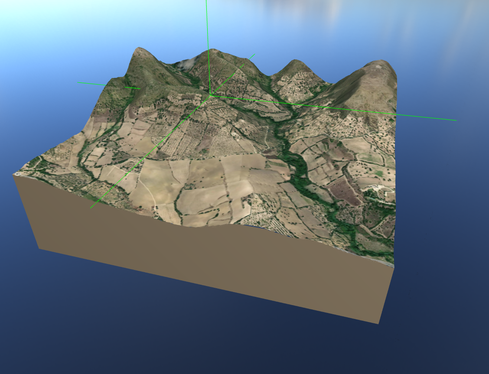

\newpage


# Introduction

A 3D map made using three.js with raycaster functionality. The standard method of making a 3D map using three.js is using `displacement maps`. This approach is useful for simple use cases but is lacking in features. In particular, the built-in `displacement map` in a three.js plane does not support raycasting. Furthermore, closing the sides on a plane that uses a `displacement map` using a box geometry is also not supported. This 3D map uses custom-built `displacement map` functionality to solve the problems of the three.js built-in `displacement map`.

A displacement map is a gray-scale image where the brightness of a pixel represents the amount that this point on a corresponding texture should be displaced by.

\begin{center}
\includegraphics[]{displacement-map.png}
\end{center}

# Motivation

This project serves as a test to see whether Three.js could be used to replace and upgrade [Mapbox](https://docs.mapbox.com/mapbox-gl-js/guides/) in the [Off-Grid-CCTV](https://github.com/Liam-Weitzel/Off-Grid-CCTV) project. The aim is to create a drop-in replacement of the javascript library and API called `Mapbox`. `Mapbox` has the same raycasting issues that the built-in `displacement map` of the Three.js library has. Furthermore, the `Mapbox` API is a paid service that requires internet access to use. My implementation stores the textures on the web server meaning that users within the same local network do not need internet access to view the map. 

# Implementation

To view the github repository please visit: <https://github.com/Liam-Weitzel/Off-Grid-CCTV/tree/main/web/map>  

Unfortunately, the built-in `displacement map` attribute of any material in three.js is applied using the GPU. Whereas, the built-in raycaster function works primarily on the javascript side. Thus vertices changed on the GPU are not accessible by the raycaster function. This means to use the existing raycaster function we have to create a copy/ representation of the three.js object using vanilla javascript. The intersections can inturn be computed using its vanilla javascript clone, and represented on the original three.js object.

# Setup
1. Clone the repo: `git clone https://github.com/Liam-Weitzel/Off-Grid-CCTV.git`  
2. (Optional) Generate a height-map and satellite image using [heightmap](https://heightmap.skydark.pl/). Replace the default `height-map.png` and `texture.png` in the /static directory.  
3. Download [Node.js](https://nodejs.org/en/download/) version 16.20.2.  
4. Run the following commands:  

``` bash
# Install dependencies (only the first time)
npm install

# Run the local server at localhost:8080
npm run dev

# Build for production in the dist/ directory
npm run build
```
